Launch a Linux Virtual Machine with Amazon ***Lightsail***:  
  
Create first instance via ***EC2***:  
  
Create a ***snapshot*** of this instance:  
  
Create new ***volume***:  
  
*Attach volume* to the instance:  
  
Create file on the disk:  
  
Create ***image*** from ***snapshot***:  
  
Create **instance** from ***AMI***:  
  
**Instance** from **snapshot**:  
  
***Detach*** from the first instance:  
  
***Attach*** the disk to the seccond instance:  
  
Launch and configure a *WordPress* instance via **Amazon Lightsail**:  
  
  
Create a ***bucket***:  
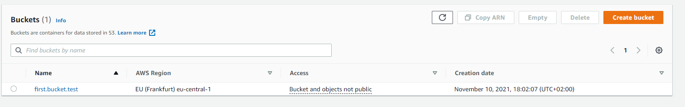  
Create a ***user***:  
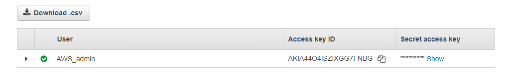  
AWS CLI ***config and upload***:  
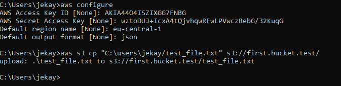  
  
  
------------
# DOCKER
  
  
  
In order to install Docker on Linux you need:  
```
sudo apt update
sudo apt install docker-ce
```
Check Docker status:  
```
sudo systemctl status docker
```
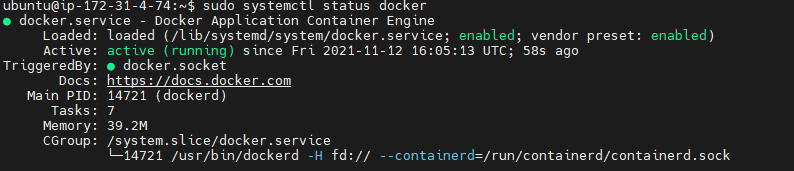  
Check Docker info:  
```
docker info [OPTIONS]
```
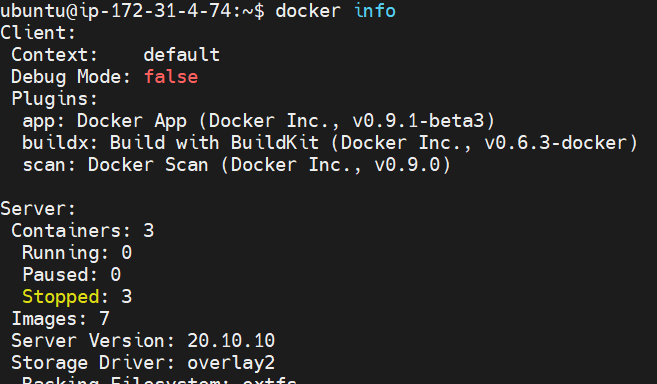  
Check list of ***Docker images*** on the device:
```
docker images [OPTIONS] [REPOSITORY[:TAG]]
```
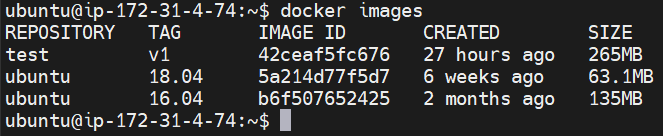  
In order to download image from ***Docker hub*** you need:  
```
docker pull tomcat
```
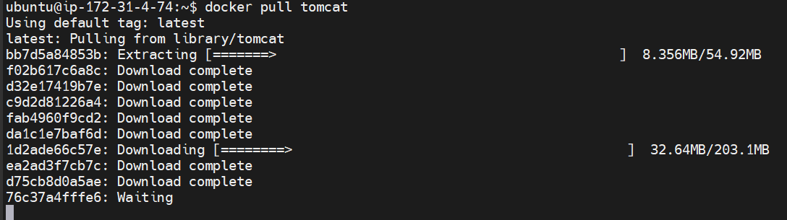  
In order to **run Docker image** you need *docker run [OPTION] [IMAGE]*:  
*-t* : Allocate a pseudo-tty;  
*-i* : Keep STDIN open even if not attached;  
*-p* : Publish all exposed ports to the host interfaces  
```
docker run -it -p 1234:8080 tomcat
```
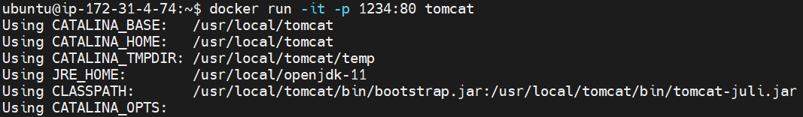  
Create my own ***Dockerfile***:  
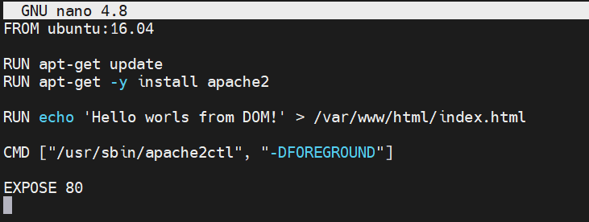  
In order to create **image** from **Dockerfile** you need (-t name and optionally a tag in the 'name:tag' format):  
```
docker build -t maksym:v1 .
```
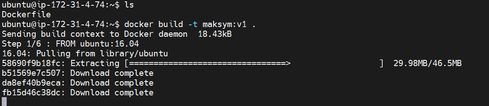  
To display ***Docker process*** you need (-a option will show all the containers both stopped and running):  
```
docker ps -a
```
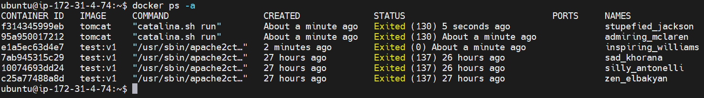  
If you want to *remove* the **Docker container**, you need to use:
```
docker rm [OPTIONS] [CONTAINER]
```
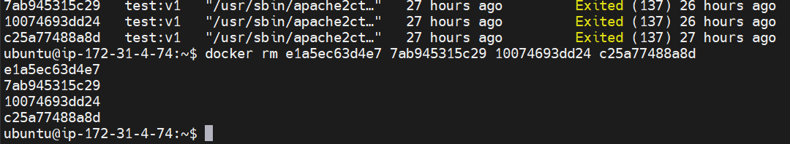  
If you want to *remove* the **Docker image** from the device, you need to use: 
```
docker rmi [OPTIONS] [IMAGE]
```
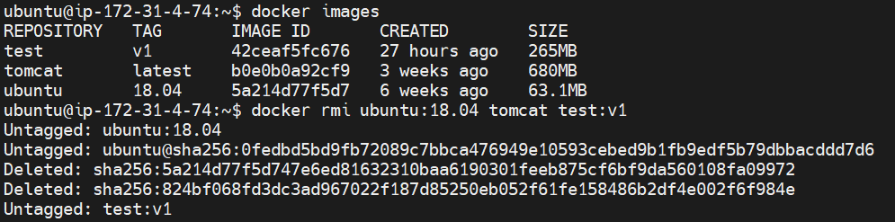  
  
  
------------
# Amazon ECS
  
  
  
Create ***repository***:
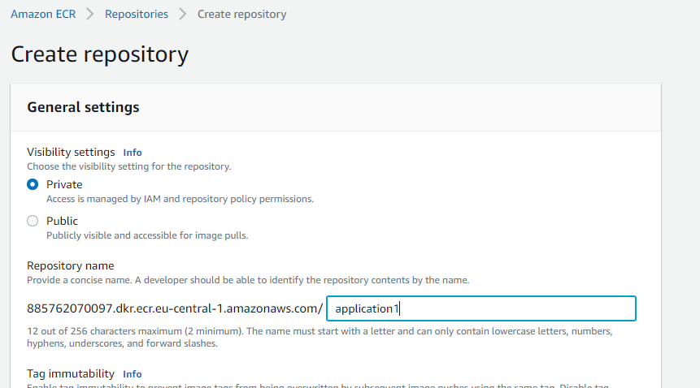  
AWS login:  
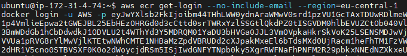  
Rename a docker *image* to make it possible to *push* to the **ECS repository**:  
```
docker tag [old_name] [aws_account_id.dkr.ecr.region.amazonaws.com/repository_name:version]
docker push aws_account_id.dkr.ecr.region.amazonaws.com/repository_name:version
```
  
**Repository state** after several *pushes*:  
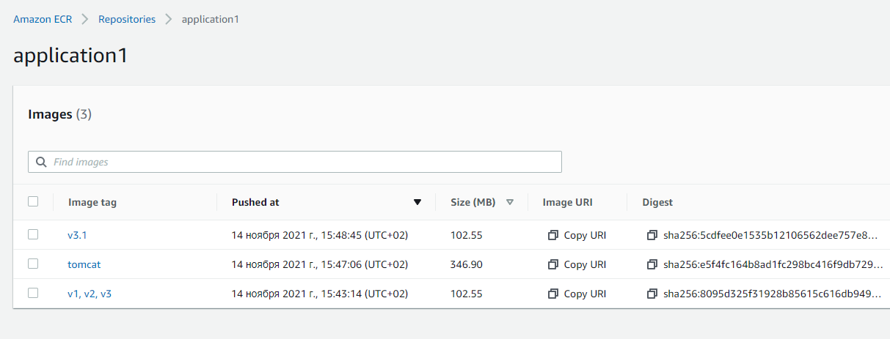  
Create ***lifecycle*** in order to delete old images:  
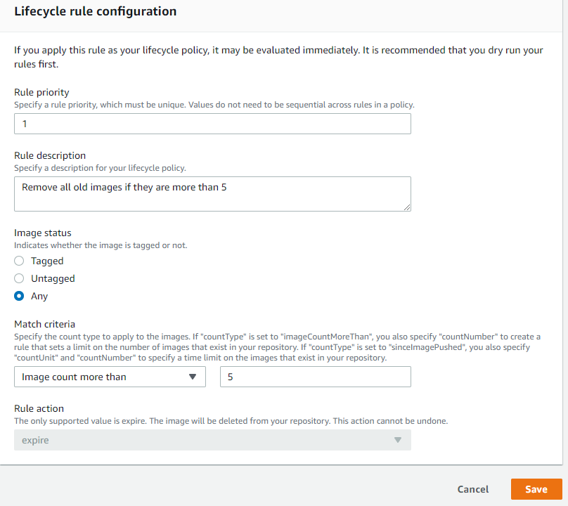  
Pull **Docker image** from repository:  
```
docker pull aws_account_id.dkr.ecr.region.amazonaws.com/repository_name:version
```
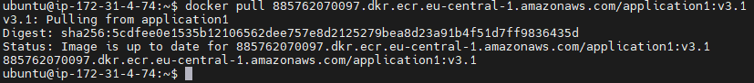  
Create ***ECS Cluster***:  
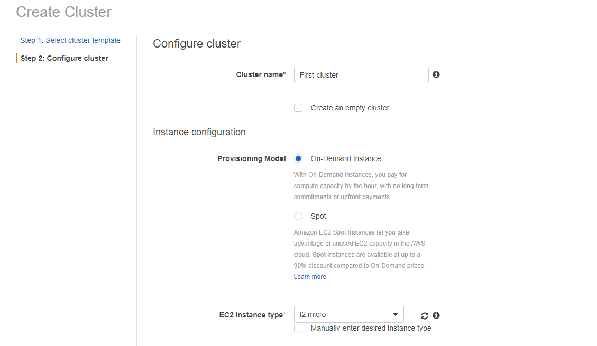  
Create ***task definition***:  
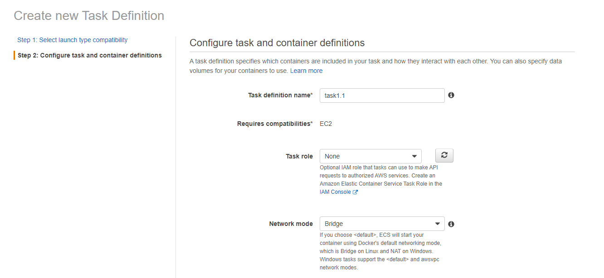  
Add **container** to the **task definition**:  
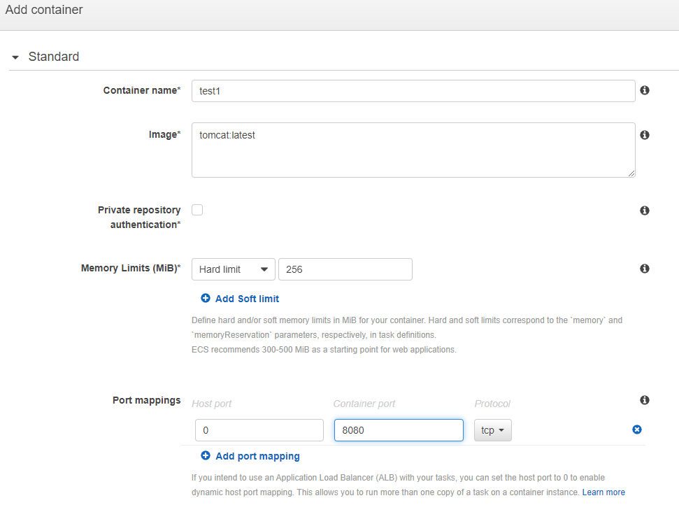  
Add my own **container** to the another **task definition**:   
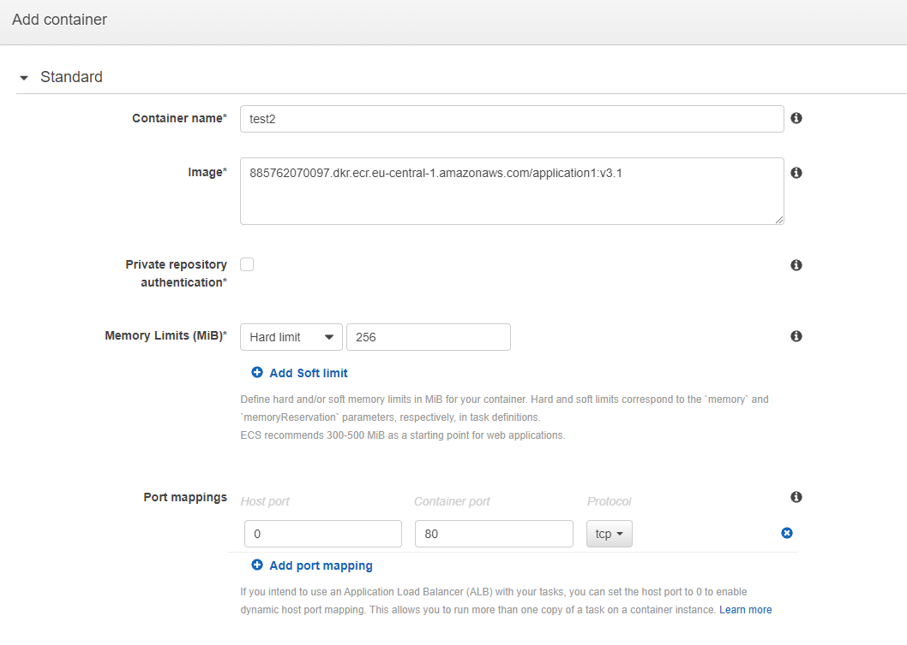  
Result:  
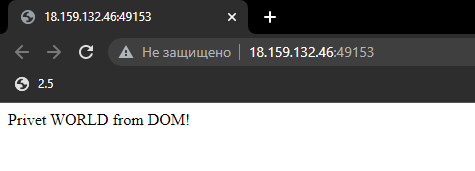  
  
  
------------
# Route 53
  
  
  
Create ***buckets*** with the ***domain*** name:  
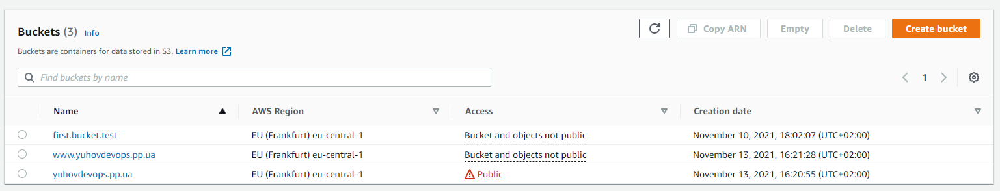  
Change ***bucket policy***:  
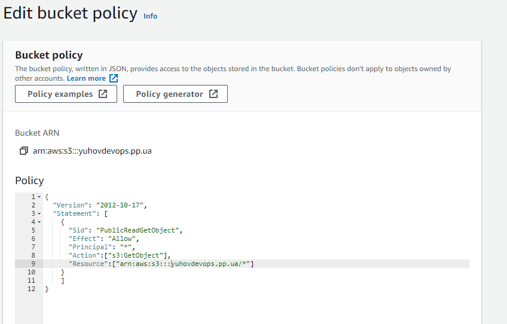  
Configure ***static website hosting***:  
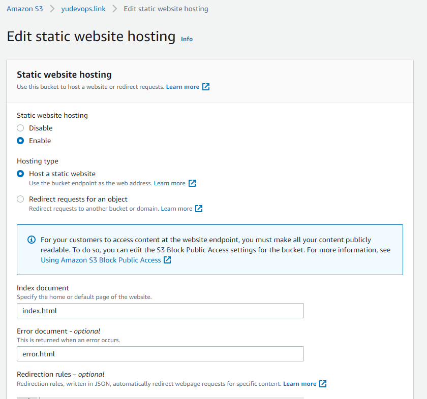  
Configure ***redirect*** in *static website hosting*:  
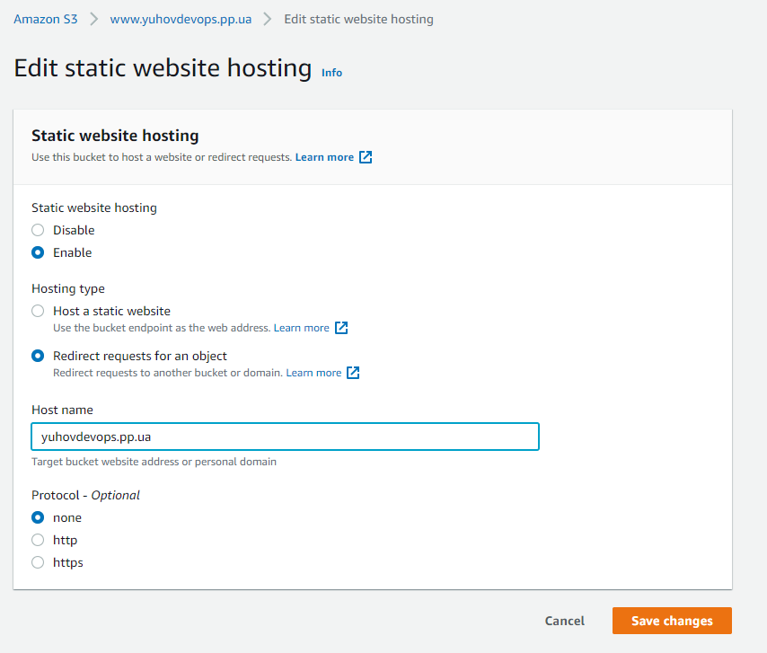  
Create ***hosted zone*** in **Route 53**:  
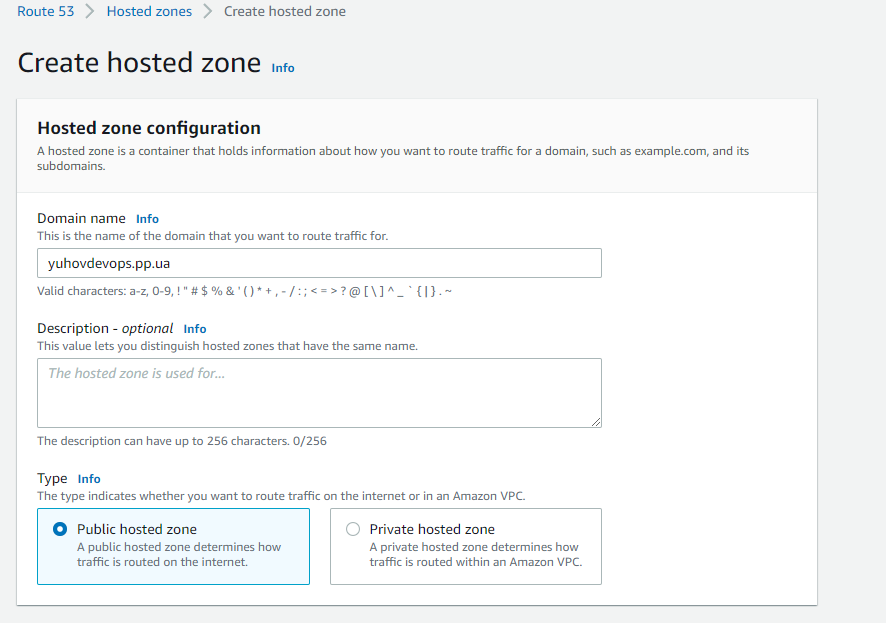  
Create ***record with alias***:  
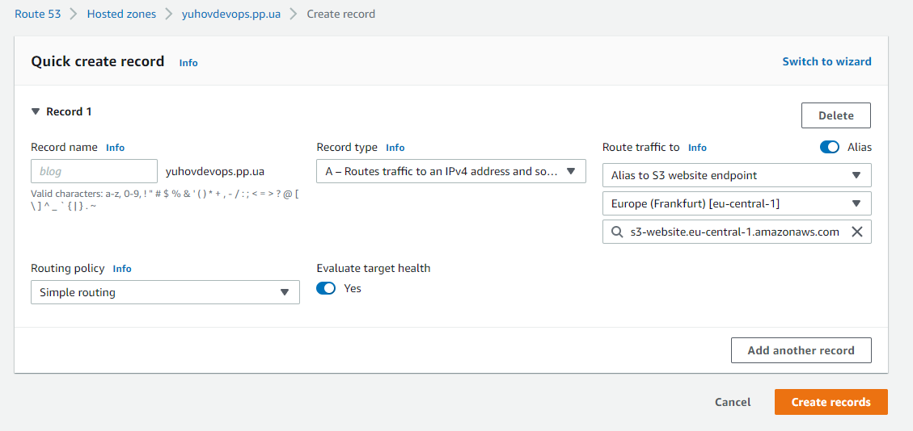  
Total **Route 53** records in my domain:  
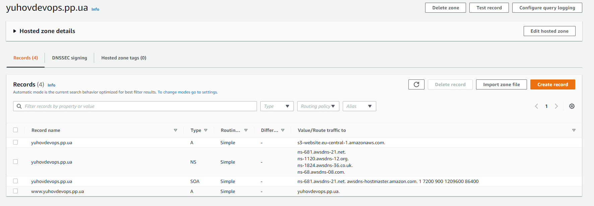  
Result:  
yuhovdevops.pp.ua
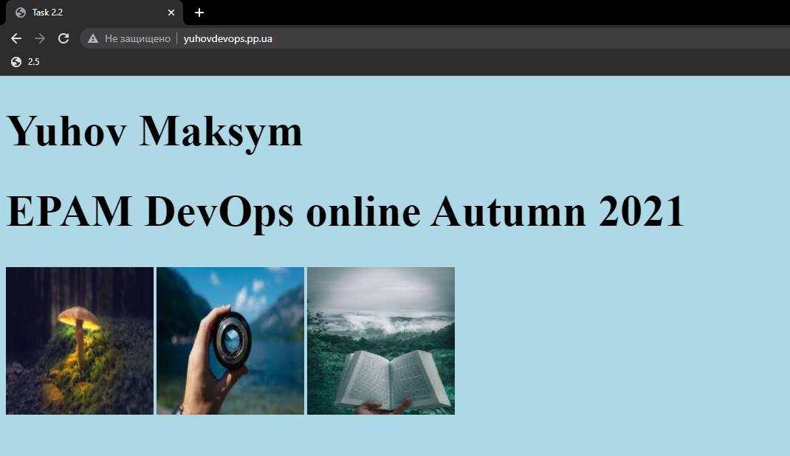  


