Launch a Linux Virtual Machine with Amazon ***Lightsail***:  
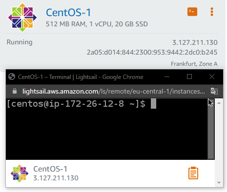  
Create first instance via ***EC2***:  
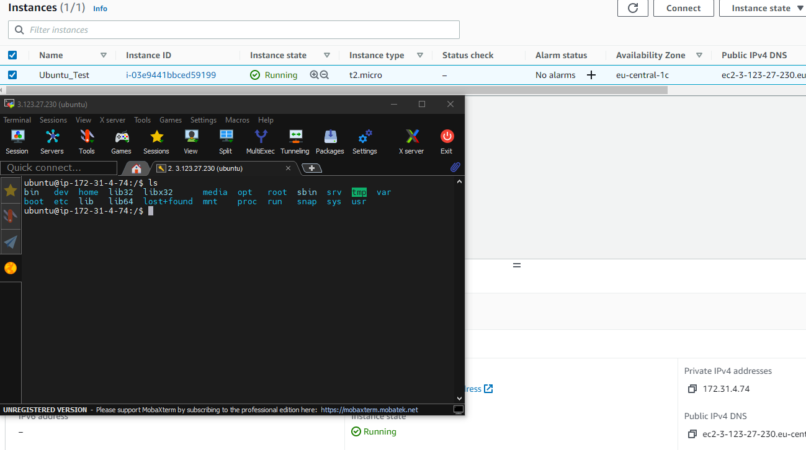  
Create a snapshot of this instance:  
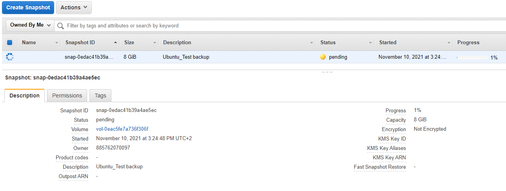  
Create new volume:  
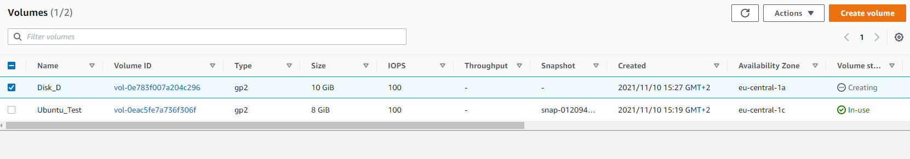  
Attach volume to the instance:  
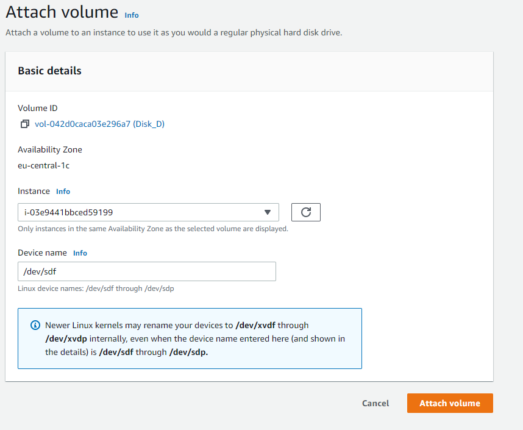  
Create file on the disk:  
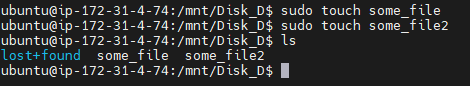  
Create ***image*** from ***snapshot***:  
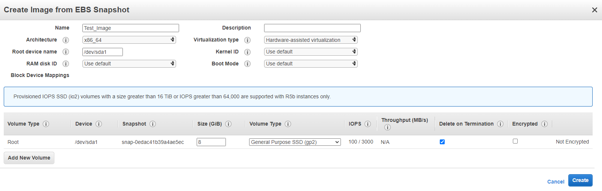  
Create **instance** from ***AMI***:  
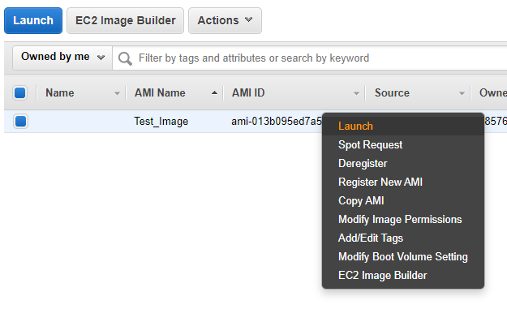  
**Instance** from **snapshot**:  
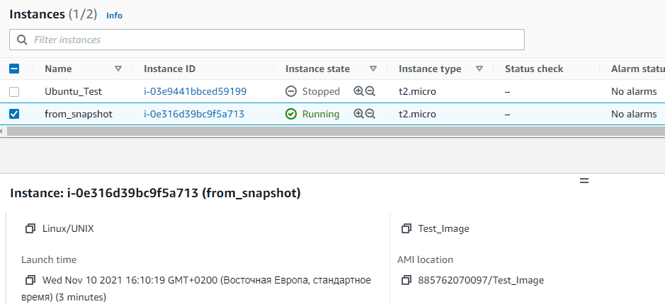  
***Detach*** from the first instance:  
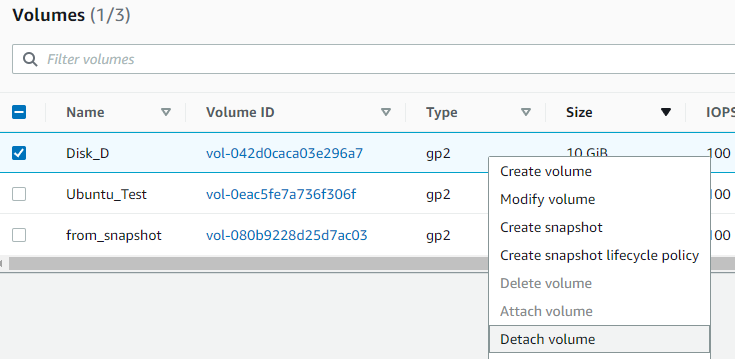  
***Attach*** disk to the seccond disk:  
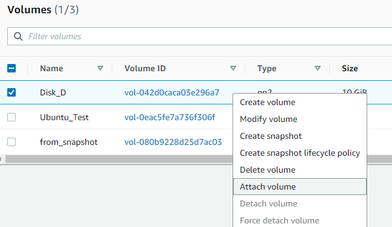  
Launch and configure a WordPress instancewith Amazon Lightsail:  
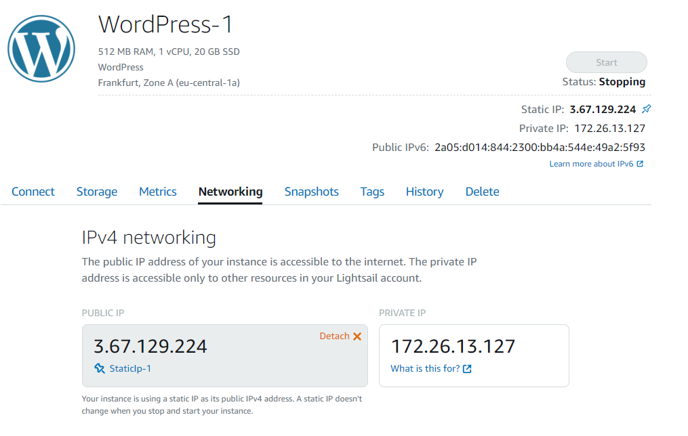  
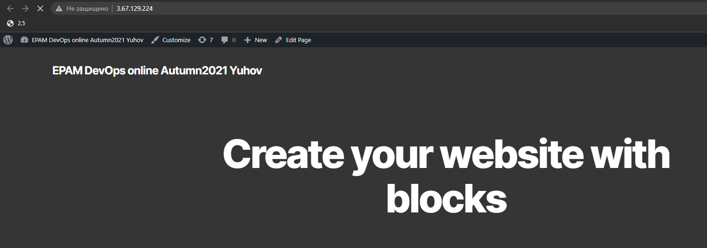  
