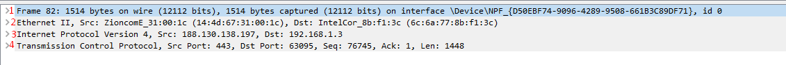

TASK 3.1

  
PACKET TRACER  
  
**Ping** computers inside *"Enterprise"* network:  
  
**Ping** servers inside *"Data Center"* network:  
  
**Ping** PC and **router** inside *"Home Office"* network:  
  
Task 3.1 result:  
  
  
WIRESHARK  
  
*TCP-segment*:  
  
TCP layer *headings*:  
  
1. Physical layer  
2. Channel layer  
3. Network layer  
4. Transport layer  

When you **click on a line**, the heading of the corresponding layer is highlighted: 
  
***Physical*** layer:  
  
***Data link*** layer:  
  
***Network*** layer:  
  
***Transport*** layer:  
  
  
*Source IPv4* address:  188.130.138.197  
*Destination IPv4* address: 192.168.1.3  
Source *port*: 443  
Destination *port*: 63095  
Source *MAC-address*: 14:4d:67:31:00:1c  
Destination *MAC-address*: 6c:6a:77:8b:f1:3c  

  
----------
  

TASK 3.2

  
  

