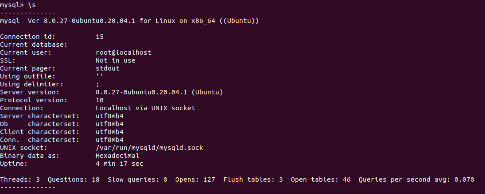
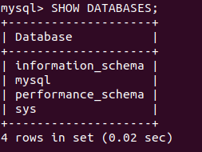
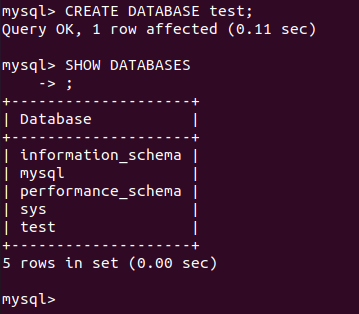
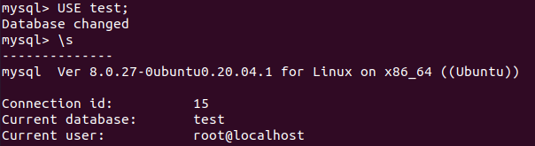

After installing ***mysql*** on the station I *need to login*, I used:  
```
mysql -u root
```
I wanted to login using password, so I **changed the password**:  
```
mysqladmin -u root password 'write_password'
```
After that I can use:  
```
mysql -p
```
To display **mysql status**, I used:  
```
status;
\s
```
  
In order to ***see the existing databases***, I used:  
```
SHOW DATABASES;
```
  
Then I created a new database and display the result of it: 
```
CREATE DATABASE test;
SHOW DATABASES;
```
  
To change my **current database** and display the current one, I used: 
```
USE test;
\s
```
  

