<details><summary>PART 1</summary>
  
After installing ***mysql*** on the station I *need to login*, I used:  
```
mysql -u root
```
I wanted to login using password, so I **changed the password**:  
```
mysqladmin -u root password 'write_password'
```
After that I can use:  
```
mysql -p
```
To display **mysql status**, I used:  
```
status;
\s
```
  
In order to ***see the existing databases***, I used:  
```
SHOW DATABASES;
```
  
Then I created a new database and display the result of it: 
```
CREATE DATABASE test;
SHOW DATABASES;
```
  
After creating database I needed to ***use*** it:  
  
To ***create table*** and display the result of it, I used:  
```
CREATE TABLE users (id INT(5) AUTO_INCREMENT PRIMARY KEY, name VARCHAR(64), surname VARCHAR(64), age TINYINT(3), 
email VARCHAR(64), status VARCHAR(128)) DEFAULT CHARACTER SET UTF8;

SHOW TABLES;
```
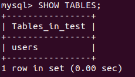  
Then I decided to check the table:  
```
DESCRIBE users;
```
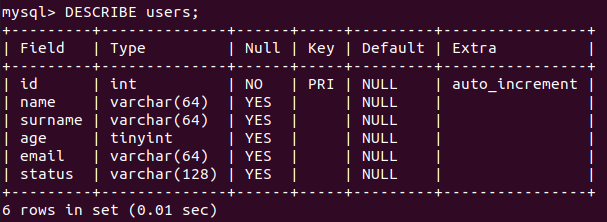  
After finding out that everything is fine, I began to ***fill in the table***:  
```
INSERT INTO users VALUES ('1', 'Maksym', 'Yuhov', '17', 'kyrkyrkyr99@gmail.com', 'work');
SELECT * FROM users
```
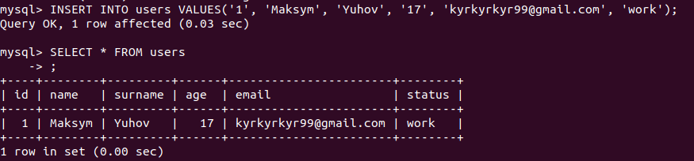  
Then I added some new users and display the result:  
```
INSERT INTO users VALUES (NULL, 'Oleksii', 'Oko', '23', 'oo.oko@gmail.com', 'vacation');
INSERT INTO users VALUES (NULL, 'Kirill', 'Suskorov', '20', 'k.suskorov@gmail.com', 'work');
INSERT INTO users VALUES (NULL, 'Dima', 'Kolo', '18', 'd.kolo@gmail.com', 'business trip');
SELECT * FROM users
```
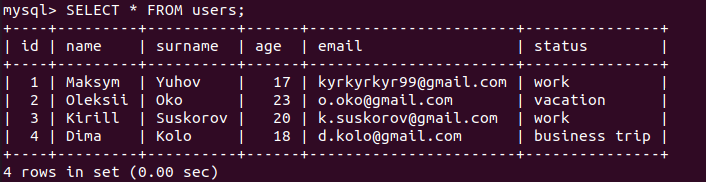  
To see pesons over 18 years old, I used ***WHERE***:  
```
SELECT * FROM users WHERE age > 18;
```
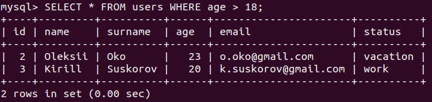  
In order to count the number of people of a certain age, I used ***GROUP BY***:
```
SELECT age, COUNT(*) as count FROM users WHERE age > 16 GROUP BY age;
```
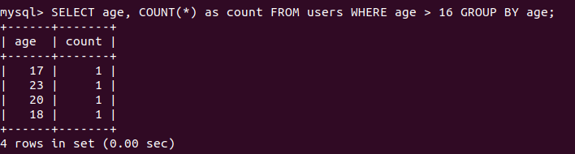  
To sort persons by age, I used ***ORDER BY***:
```
SELECT * FROM users WHERE id > 0 ORDER BY age;
```
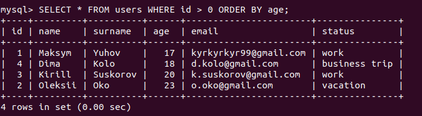  

Create two new tables:  
```
CREATE TABLE profession(id INT(5) AUTO_INCREMENT PRIMARY KEY, user_id INT(5), FOREIGN KEY (user_id)  references users(id), profession VARCHAR(32));
CREATE TABLE salary(id INT(5) AUTO_INCREMENT PRIMARY KEY, user_id INT(5), FOREIGN KEY (user_id)  references users(id), salary int(6));
```
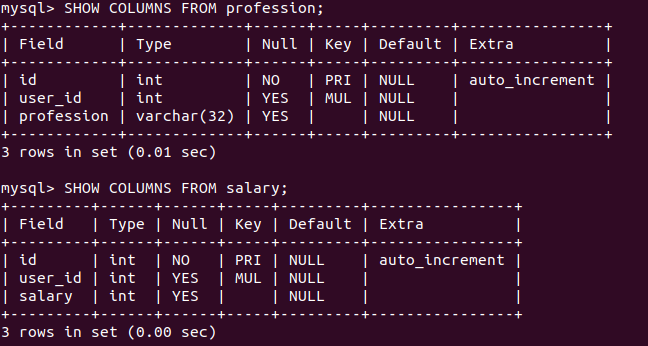  
Add some info into the tables:  
```
INSERT INTO profession (user_id, profession) VALUES (1, "profession1"), (2, "second_profession"), (1, "third_prof"), (1, "four_prof");
INSERT INTO salary (user_id, salary) VALUES (1, 1000),  (1, 1000), (2, 2000), (3, 3000) ,(4, 4000);
```
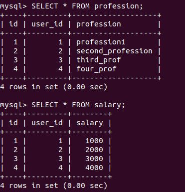  
Make JOIN:  
```
SELECT user.id, profession.profession FROM users INNER JOIN profession ON users.id = profession.user_id;
SELECT user.id, salary.salary FROM users INNER JOIN salary ON users.id = salary.user_id;
```
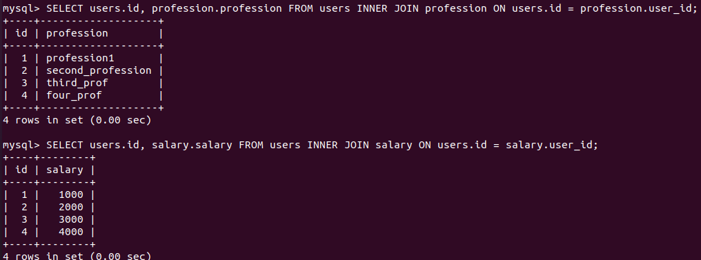  
***DDL***:
----------
*Rename*:  
```
ALTER TABLE users RENAME TO first;
```
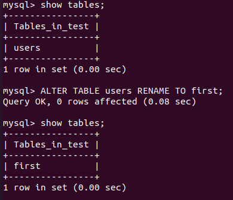   
*Add* a column:  
```
ALTER TABLE first ADD test_column char(10);
```
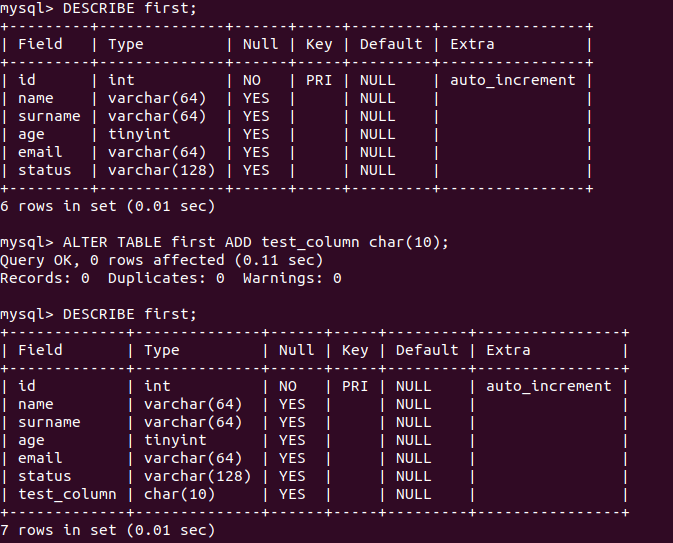   
*Delete* a column:  
```
ALTER TABLE first DROP COLUMN test_column;
```
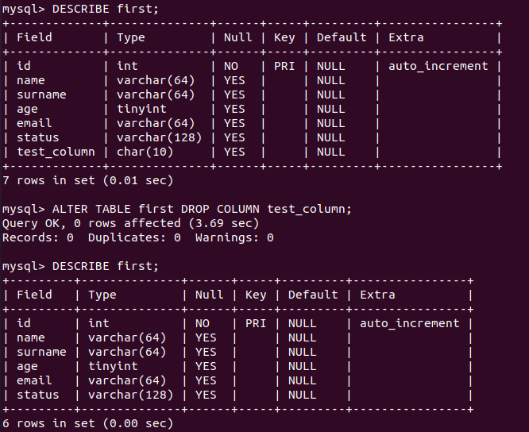   
***DML***:
----------
*Change info* in a table:  
```
UPDATE users SET age = 24 WHERE age = 20;
```
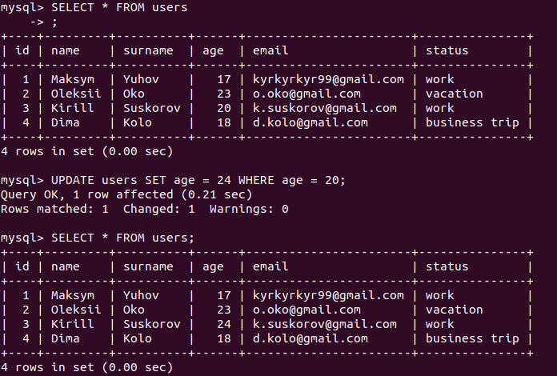  
*Delete info* from a table:  
```
DELETE FROM users WHERE age = 24;
```
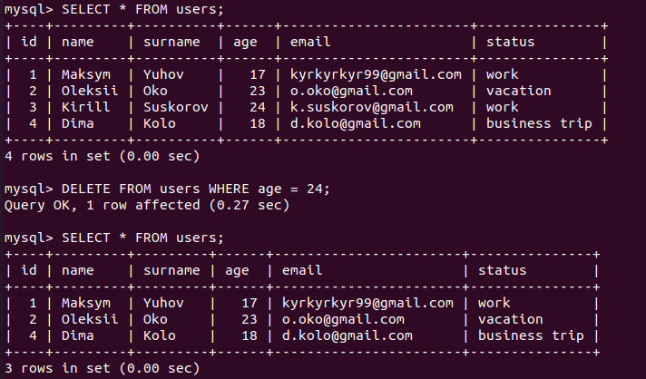  
***DCL***:
----------
*GRANT* - Grants a user or group permission to perform certain operations on an object;  
*REVOKE* - revokes the issued permission;  

***Create two new users*** and then **display the list of current users**:  
```
CREATE USER 'second_user'@'localhost' IDENTIFIED BY '1234'
CREATE USER 'third_user'@'localhost' IDENTIFIED BY '1234'
```
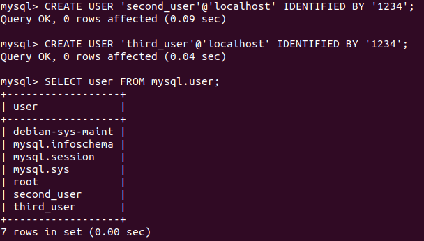  
***Give privileges*** to the new users:  
```
GRANT ALL PRIVILEGES ON users.* TO 'second_user'@'localhost';
GRANT SELECT,UPDATE ON users.* TO 'third_user'@'localhost';
```
Display their ***privileges***:  
```
SHOW GRANTS FOR 'second_user'@'localhost';
SHOW GRANTS FOR 'third_user'@'localhost';
```
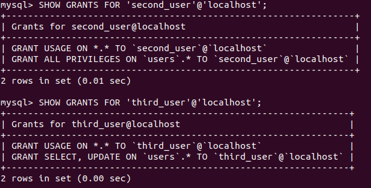  
Test the privileges:  
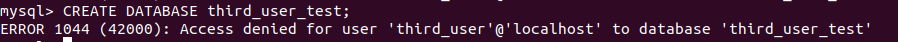  
***Revoke*** their privileges:  
```
REVOKE ALL PRIVILEGES ON users.* TO 'second_user'@'localhost';
REVOKE UPDATE ON users.* TO 'third_user'@'localhost';
```
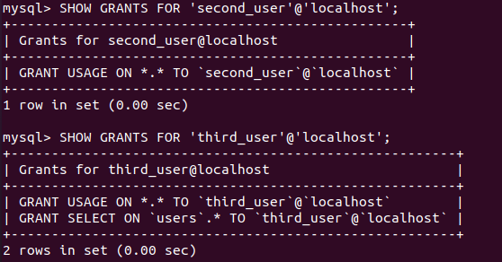  
***Delete*** the users:  
```
DROP USER 'second_user'@'localhost';
DROP USER 'third_user'@'localhost';
```
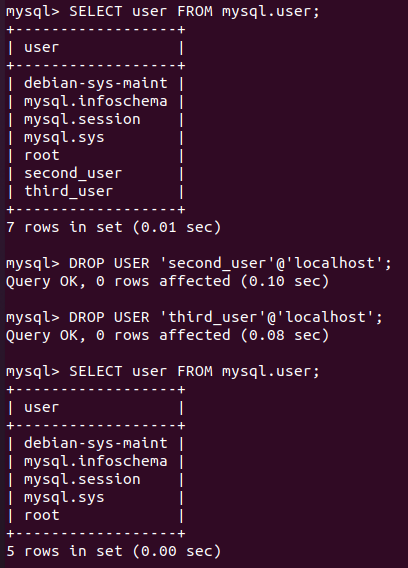  
</details>

<details><summary>PART 2</summary>
  
***MYSQLDUMP***
-------
***Make backup*** of my DB:
```
mysqldump -u root -h localhost test > test_back.sql                               // One DB  
mysqldump -u root -h localhost —databases test mysql > test_mysql_back.sql        // Several DB  
mysqldump -u root -h localhost —all-databases > all_db_back.sql                   // All DB
```
Restore DB:  
```
mysql -u root -h localhost test_back < test_back.sql      // One DB 
mysql -u root -h localhost  < all_db_back.sql             // Several DB
mysql -u root -h localhost  < test_mysql_back.sql         // All DB
```

***RDS***
-------                                                 
Create ***a database on RDS***:  
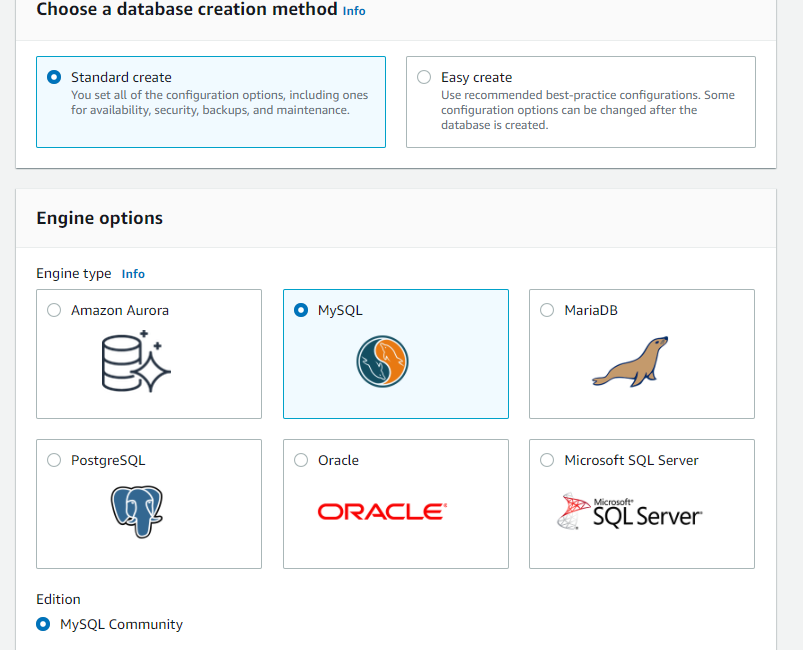  
After creating find ***the endpoint***:  
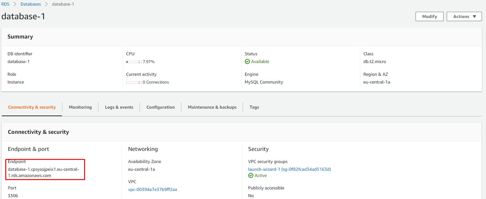  
To connect to RDS database, I used:  
```
mysql -u account_name -h endpoint -p
mysql -u admin -h database-1.cpsysojpeix1.eu-central-1.rds.amazonaws.com -p
```
Databases in the RDS database:  
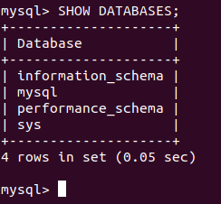  
To transfer my local database, I used:  
```
mysql -u admin -h database-1.cpsysojpeix1.eu-central-1.rds.amazonaws.com -p test_table < test_back.sql
```
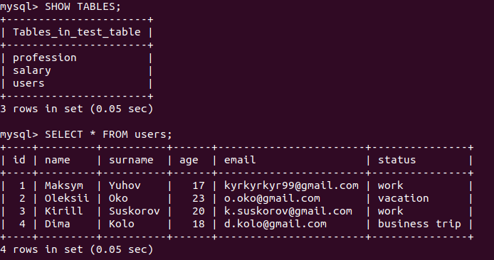  
To make backup from the RDS database, I used:  
```
mysqldump -u admin -h database-2.cpsysojpeix1.eu-central-1.rds.amazonaws.com -p test_table > test_table_back.sql
```                                                
</details>
