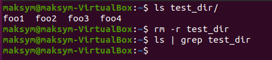

<details><summary>PART 1</summary>
  
Log in into the system as root:  
```
sudo su - root
```
***su*** allows commands to be run with a substitute user and group ID.  
Change the root password:  
```
passwd
```
If run ***passwd*** command without option you will be changing current user's password.  
-S Display account status information  
-d Delete a user's password  
-x Set the maximum number of days a password remains valid  
1. Secure user account information /etc/shadow  
2. User account information /etc/passwd  
3. PAM configuration for passwd /etc/pam.d/passwd  
Display the information about a user:  
```
who 
finger 
```
  
To check what command they execute you can use:  
```
ps -u | grep maksym
top 
htop
```
  
Change personal information about a user:  
```
chfn maksym
```
  
***chfn*** is used to change your finger information. This information is stored in the */etc/passwd* file, and is displayed by the ***finger***   
program. The Linux ***finger*** command will display four pieces of information that can be changed by ***chfn***  
  
  
***man*** is the system's manual pager.  Each page argument given to ***man*** is normally the name of a program, utility or function.  
*The manual page* associated with each of these arguments is then found and displayed.  
***Man*** examples:  
```
man chfn
man ps
```
  
  
Using ps,chfn with keys:  
```
chfn -r 9 maksym
chfn -h 111 maksym
```
  
```
ps -a
ps -d
```
  
To see the content of a file you can use ***more*** or ***less***. To see the documentation about these commands, I used:  
```
man more
man less
```
***more*** - is a filter for paging through text one screenful at a time.  
***less*** - is a program similar to more(1), but which allows backward movement in the file as well as forward movement.  
*more and less* have the option to view multiple files at once. *more* allows us to view them as a single file separated by lines, and *less* allows us to switch between them.
However, both *more and less* display all the opened files with the same options.  
  
  
To display a content of the home directory, I used ***ls*** command with some keys:  
```
ls -lah
```
*-a* - do not ignore entries starting with  
*-h* - make the output more readable for people  
*-l* - use a long listing format  
  

</details>

<details><summary>PART 2</summary>

Tree command + grep:  
```
tree -L 2 | grep c
```
*-L* - Max display depth of the directory tree  
  
To determine ***the type of files***, I used:  
```
file * 
```
  
To navigate in the system you can use:  
```
cd [path]
pwd 
```
***pwd*** to check the position  
  
To check a content of a directory, I used:
```
ls
ls -a
ls -la
``` 
***ls*** - list directory contents  
*-a* - do not ignore entries starting with .  
*-l* - use a long listing format  
  
In order to create a directory, I used:  
```
mkdir [directory_name]
```
  
To redirect an output, I used **>** symbol:  
```
ls / > test_dir/file.txt
```
***>*** - creates file if it doesn't exist and overwrite if it exist  
  
To copy the file, I used:  
```
cp [SOURCE] [DESTIONATION]
```
To remove the file, I used:  
```
rm [FILE]
```
  
To remove a directory you can use ***rm*** with ***-r key***:  
```
rm -r test_dir
```
  


</details>


