PROCESS STATES
--------------
The are ***5 states of a process in Linux***:
- ```R``` – RUNNING/RUNNABLE
- ```S``` – INTERRRUPTABLE_SLEEP
- ```D``` – UNINTERRUPTABLE_SLEEP
- ```T``` – STOPPED
- ```Z``` – ZOMBIE
- ```I``` - IDLE

<h3>RUNNING & RUNNABLE</h3>  
When the CPU executes a process, it will be in a RUNNING state. When the process is not waiting for any resource and ready to be executed by the CPU, it will be in the RUNNABLE state.

<h3>SLEEPING</h3>   
SLEEPING state indicates the process is currently waiting on certain resources (like waiting on I/O, waiting on locks, application code making the process to sleep,…). There are two types of SLEEPING processes:
INTERRUPTABLE_SLEEP: When a process is in INTERRUPTABLE_SLEEP, it will wake up from the middle of sleep and process new signals sent to it.
UNINTERRUPTABLE_SLEEP: When a process is in UNINTERRUPTABLE_SLEEP, it will not wake up from the middle of sleep even though new signals are sent to it.

<h3>STOPPED</h3>   
STOPPED state indicates that the process has been suspended from proceeding further. In Linux when you issue the ‘Ctrl + Z’ command it will issue a SIGSTOP signal to the process. When the process receives this signal it will be suspended/stopped from executing further.

<h3>ZOMBIE</h3>   
They're processes that have completed their execution, but their entries are not removed from the process table.

<h3>IDLE</h3>    
Special task loaded by the OS scheduler on a CPU when there is nothing for the CPU to do
  
2)pstree shows running processes as a tree.  The tree is rooted at either pid or init if pid is omitted.  If a user name is specified, all process trees rooted at processes owned by that user are shown.  
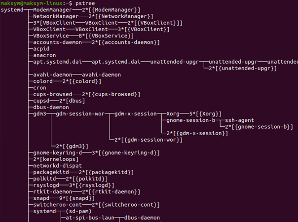  
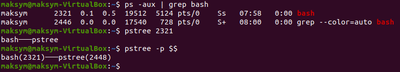  


PROC FILE SYSTEM
--------------
The ```/proc``` file system is ***a virtual file system in Linux.***
The ```/proc``` file system is ***an interface to internal data structures nucleus***. In Linux processes cannot access the system kernel directly and use /proc directory where is concentrated all information about system. 
There is a special subdirectory ```/proc/sys``` that allows you view kernel settings  
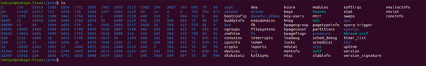  

  
PROCESSOR INFO
--------------
You can use ```lscpu``` command or ```/proc``` directory via ```cat /proc/cpuinfo```  
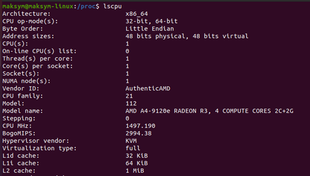  

--------------
To display all info via ```ps``` command you need to use it with ```-Fl``` keys.
- ```-F``` extra full format
- ```-l``` long format  
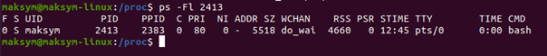  

- ```UID```   - the user on whose behalf the process was launched;  
- ```PID```   - process identifier;  
- ```PPID```  - identifier of the parent process;  
- ```C```     - the percentage of CPU time used by the process;  
- ```STIME``` - process start time;  
- ```TTY```   - terminal from which the process is started;  
- ```TIME```  - total CPU time spent on CPU execution;  
- ```CMD```   - CPU start command;  
- ```LWP```   - shows the processor flows;  
- ```SZ```    - the size of the process in memory;  
- ```RSS```   - the actual size of the process in memory;  
- ```PSR```   - the core processor on which the process is performed;  
- ```F```     - flags associated with this process;  
- ```S```     - state of the process;  
- ```PRI```   - level of the Linux kernel planning process;  
- ```NI```    - recommended priority of the process;  
- ```ADDR```  - the address of the process in memory;  
- ```WCHAN``` - the name of the kernel function through which the process is in mode expectation.  
--------------
  
To see the kernel processes you can use ```pstree 2```. To other processes ```pstree 1```.  
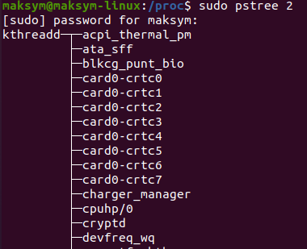   
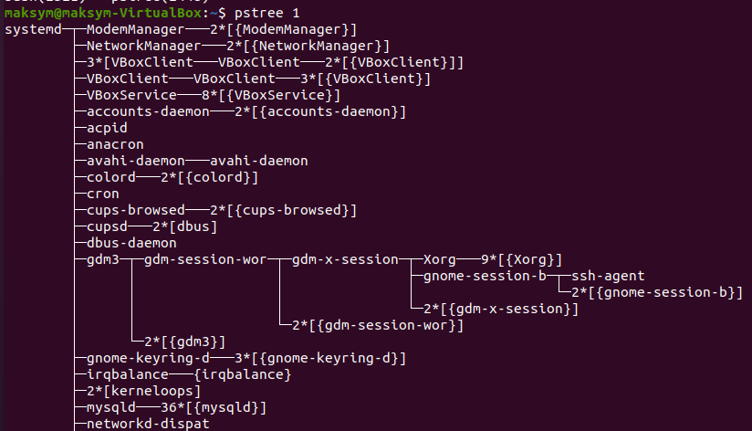  


To see all the processes you can use ```top/htop``` or ```ps -aux```.
- ```-a``` Select all processes except both session leaders and processes not associated with a terminal.
- ```-u``` userlist
  
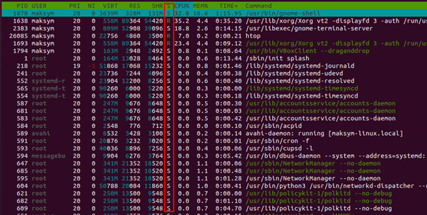  


The are ***5 states of a process in Linux***:
- ```R``` – RUNNING/RUNNABLE
- ```S``` – INTERRRUPTABLE_SLEEP
- ```D``` – UNINTERRUPTABLE_SLEEP
- ```T``` – STOPPED
- ```Z``` – ZOMBIE
- ```I``` - IDLE
  
To display all the processes of a user you can use use ```ps``` with ```-u``` key and then *the name*.  

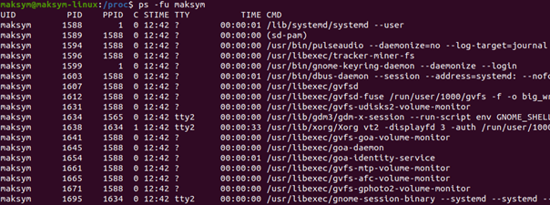  

To check the alternativies of ```ps``` command you can use ```man ps```.  
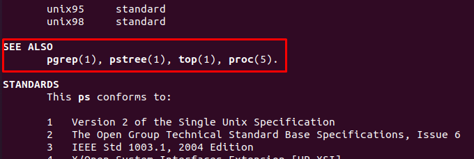  
```pgrep``` looks through the currently running processes and lists the process IDs which match the selection criteria to stdout.  All the criteria have to match.  


TOP/HTOP
--------------
The ```top/htop``` program ***provides a dynamic real-time view of a running system***.  It can display system summary information as well as a list of processes or threads currently being 
managed by the Linux kernel.
  
It displays: 
- ```PID``` - an unique identifier of the process;
- ```USER``` - the name of the user who owns the task;
- ```PR``` - the priority of the task in the schedule. If you see "rt" in this field, it is means that the task is running in the schedule of priorities in real time;
- ```NI``` - the value of a nice task. A negative value means higher priority, and a positive value of nice means a lower priority;
- ```VIRT``` - the total amount of virtual memory used by the task;
- ```RES``` - used RAM;
- ```SHR``` - the size of the shared memory;
- ```S``` - status of the process;
- ```%CPU``` - CPU usage, task share in CPU time consumed since last screen update expressed as a percentage of the total CPU time;
- ```%MEM``` - the share of the task in memory usage (RES);
- ```TIME+``` - the total CPU time used tasks since launch;
- ```COMMAND``` - Team name or Command line. Shows the command line, which is used to run the task or the name of the associated program
  
You can use ```top/htop -u user_name``` to see the **process of the user** or you can write just ```top/htop``` and then ***use the interface***.  
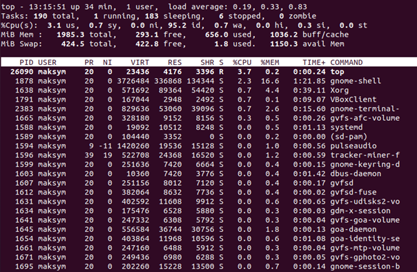  

<h4>Switch to color mode</h4>
You can use the ```z button``` to switch between monochrome and multicolored reflection.  
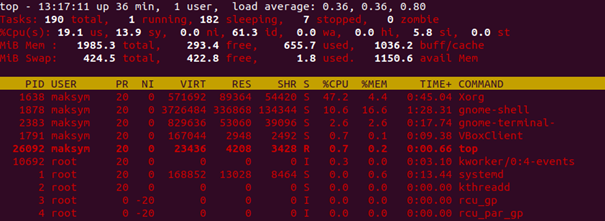  

<h4>Use of bold selection</h4>
Some data, for example, tasks that consume a lot of CPU time, stand out bold. This is the default behavior. It is possible disable/enable with ```b button```.  
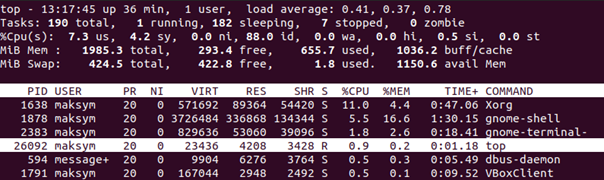  
  
<h4>Highlight the column used for sorting</h4>
If you forgot which column is used for sorting, then click the ```x button``` and this column will be highlighted in bold.    
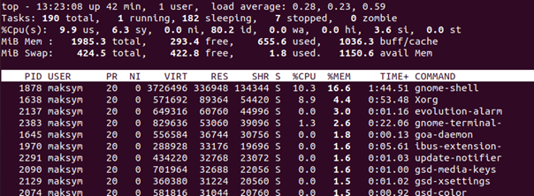  
  
To *sort the processes* via ```top/htop``` you can ***push F6 button*** and then *choose what you need to sort by*.  
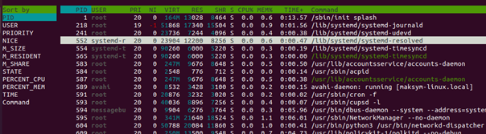  

PRIORITY
--------------
***The priority (niceness (NI))*** of the process determines how often this process, in compared to other running processes queuing on execution 
will be executed by the processor.  
  
```nice -n command``` - allows you to ***change the priority with which it will be executed process after startup***. Without specifying the command, 
the command issues the current one priority of work. n defaults to 10. Priority range located from -20 (highest priority) to 19 (lowest).  
```renice [priority value] -p [process id]``` - ***change the priority to existing process*** 

Or you can change the priority via ```top/htop```. Just push ```+-``` in program.

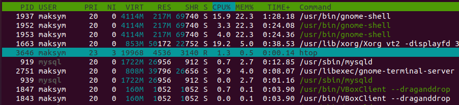  

  
  
SIGNALS
--------------

Signals are an instruments by which ***processes can be transmitted messages*** about some events in the system. The processes themselves can also generate
signals by which they transmit certain messages to the kernel and other processes.

```kill -SIGNAL pid``` - *sends a process signal* with pid ID. If signal not specified, the command sends a SIGTERM signal to the process.
  
Popular signals:  
- ```INT``` - Causes termination if simple commands are executed execution, in interactive programs - termination of the active process
- ```HUP``` - Hang up
- ```SIGTERM``` - this signal asks the process to stop. He can be ignored. The process is given time to complete correctly..
- ```SIGKILL``` - this signal causes the process to stop immediately. The program cannot ignore this signal. Unsaved results will be lost.
  
JOBS
--------------
The jobs utility shall display the status of jobs that wereb started in the current shell environment.  
```jobs``` - display a list of current background tasks.
- ```Bg``` - continue the process in the background  
- ```Fg``` - output the process from the background  
  
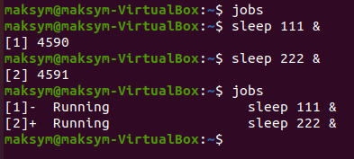  

A + (plus sign) identifies the job that will be used as a default for the fg or bg commands. This job ID can also be specified using the %+ (percent sign, plus) or %% (double percent sign). A - (minus sign) identifies the job that becomes the default if the current default job exits
```nohup``` - allows the process to continue running even when loss of control terminal (SIGHUP). 


<details><summary>SSH</summary>
    
```ssh-keygen``` - generate a keys 
```ssh user@host``` - coonect via SSH
```ssh user@host command``` - coonect via SSH and do command  
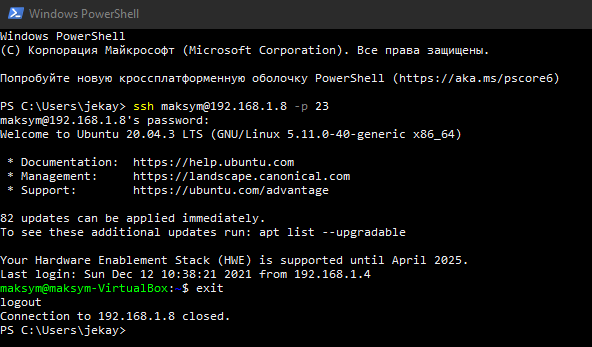  
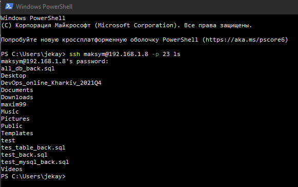  
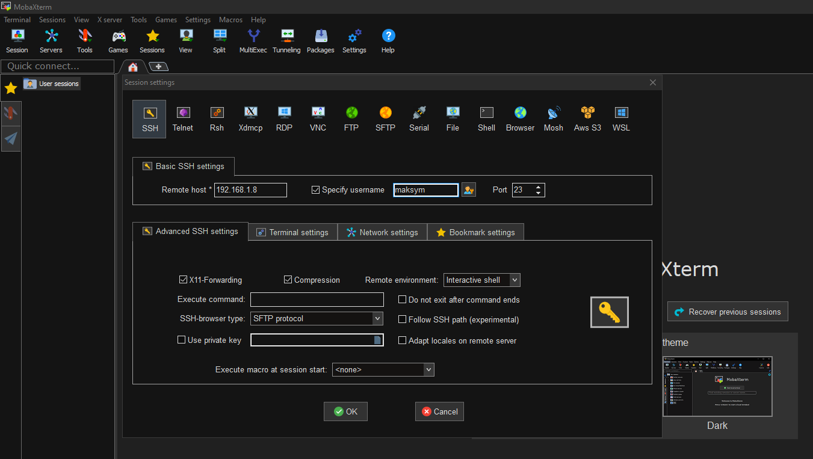  
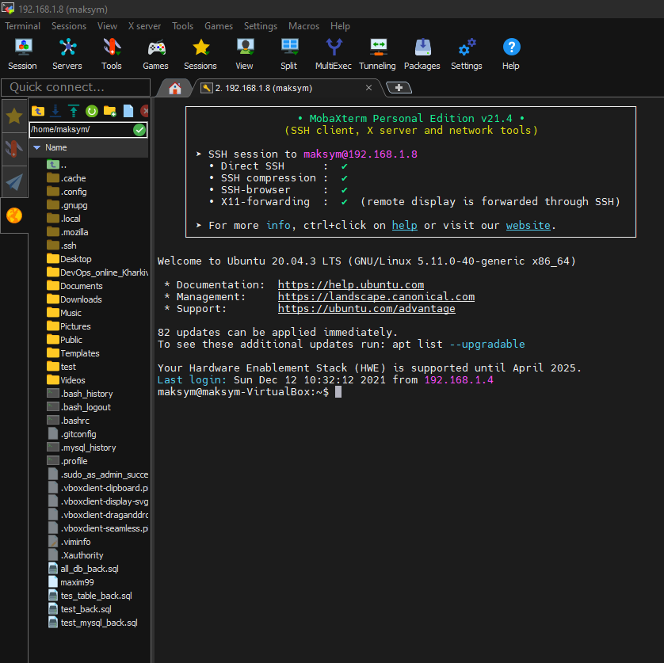  

To improve the security of the connection you can:  
1. Strong password
2. Disable empty password
3. Limited users have SSH access
4. Disable root login
5. Use only SSH protocol 2
6. Don't use 22 port
7. Use public and private keys for authentication
You can change these setting in /etc/ssh/sshd_config  
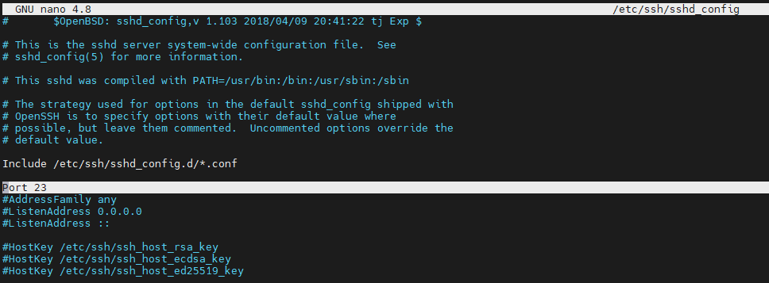  

There are 6 encryption algoritms for ```ssh-keygen```:  
1. dsa
2. ecdsa
3. ecdsa-sk
4. ed25519
5. ed25519-sk
6. rsa  
  
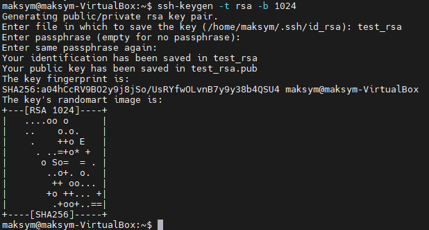  
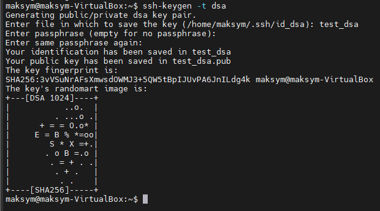  
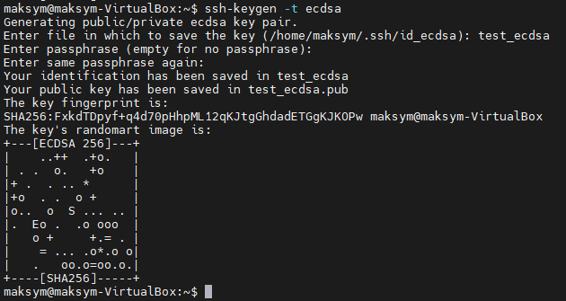  
  
SSH via NAT
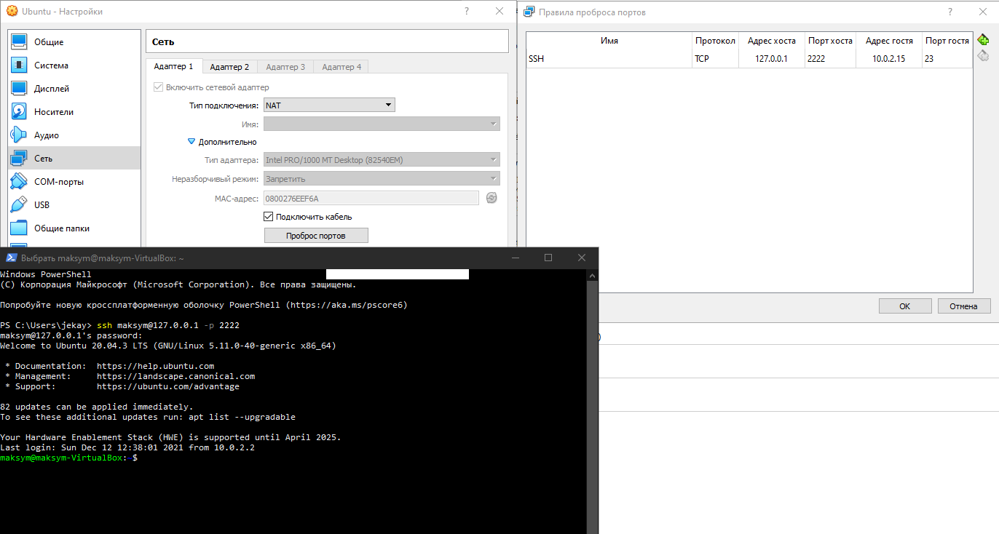  
  
TCPDUMP  
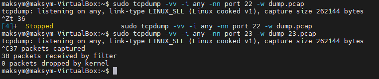  


</details>


