First virtual machine has two interfaces: NAT and internal.  
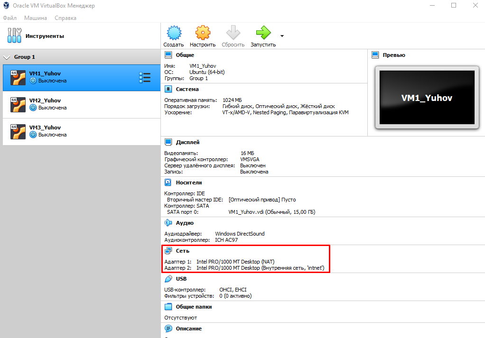  
Second virtual machine has one interface: internal.  
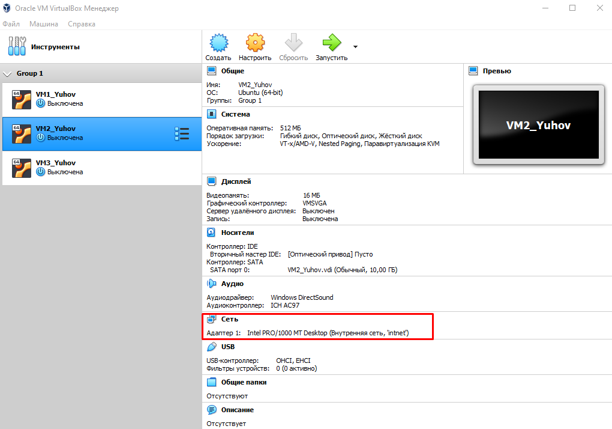  
Next step was to add an IP adress to the devices, because they don't have it.  
```
ifconfig enp0s8
ip addr add 192.168.1.1/24 brodcast 192.168.1.255 dev enp0s8
ifconfig enp0s8
```
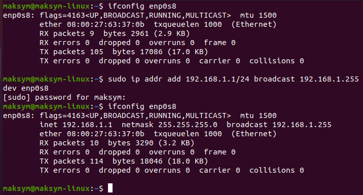  
```ifconfig enp0s8``` - to see the info about the enp0s8  
```ip``` - show/manipulate routing, network devices, interfaces and tunnels. I use to add the IP adress(192.168.1.1/24) to the enp0s8 device.  
The same thing with the second virtual machine, but with different values.  
```
ifconfig enp0s3
ip addr add 192.168.1.10/24 brodcast 192.168.1.255 dev enp0s3
ifconfig enp0s3
```
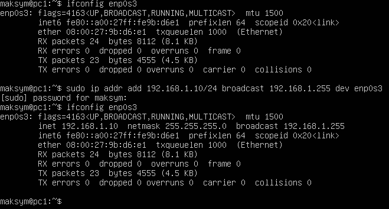  
And then check the connection between them using ```ping```.   
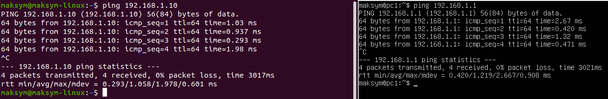  
To make possible access to the Internet from the VM2 it is needed to add ***default route***.  
```
ip route show
ip route add default via 192.168.1.1
ip route show
```
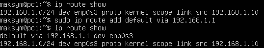  
```ip route show``` - display current routes  
```ip route add default via 192.168.1.1``` - add one more route for default(0.0.0.0/0) via 192.168.1.1  
  
It is also needed not to forget to turn on the port forwarding. There are two ways to do it:
- With reboot
- Without reboot, but only for current session  
  
To do it without rebooting I used:  
```
echo 1 > /proc/sys/net/ipv4/ip_forward
```
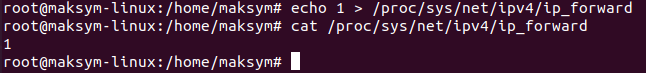  
Or you can use the second method: 
```
nano /etc/sysctl.conf
```
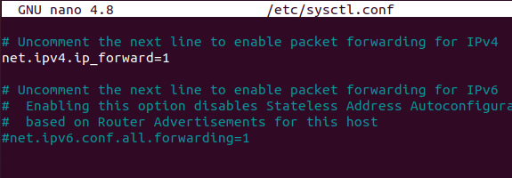  
  
------
  
Then I need to explain VM1 what to do with this traffic. For it I used ```iptables```.
```
iptables -L -t nat
iptables -t nat -A POSTROUTING -o enp0s3 -j MASQUERADE
iptables -L -t nat
```
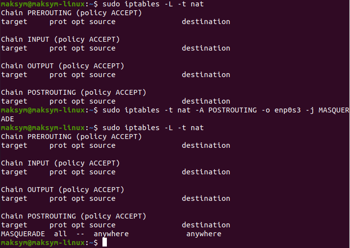  
```iptables``` is used to set up, maintain, and inspect the tables of IP packet filter rules in the Linux kernel.  
```-L, --list``` - List all rules in the selected chain.  
```-t, --table``` - This option specifies the packet matching table which the command should operate on. ***Iptables*** has 4 tables, but now I need only one, ***nat***.   
This table is consulted *when a packet that creates a new connection is encountered*. It consists of three built-ins:  
1. ***PREROUTING*** - for altering packets as soon as they come in;
2. ***OUTPUT*** - for altering locally-generated packets before routing;
3. ***POSTROUTING*** - for altering packets as they are about to go out.  
  
```-A, --append``` - Append one or more rules to the end of the selected chain(**nat** in my case).  
```-o, --out-interface``` - Name of an interface via which a packet is going to be sent (**enp0s3** in my case). For packets entering the FORWARD, OUTPUT and POSTROUTING chains.  
```-j, --jump``` - This specifies the target of the rule(**MASQUERADE** in my case)  
  
------
  
To make possible access to the host from the VM2 it is needed to specify the route to the host.
```
ip route show
ip route add 192.168.1.7 via 192.168.1.1
ip route show
```
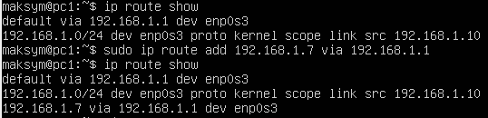  
And, finally, check connection between VM2 and the host, VM2 and the Internet.  
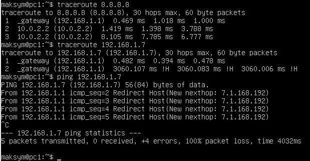  


