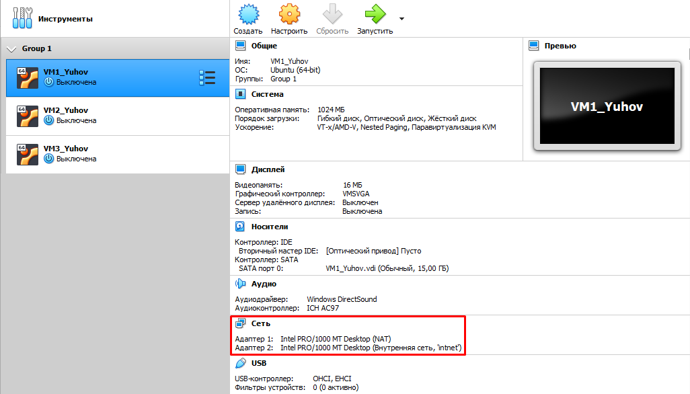
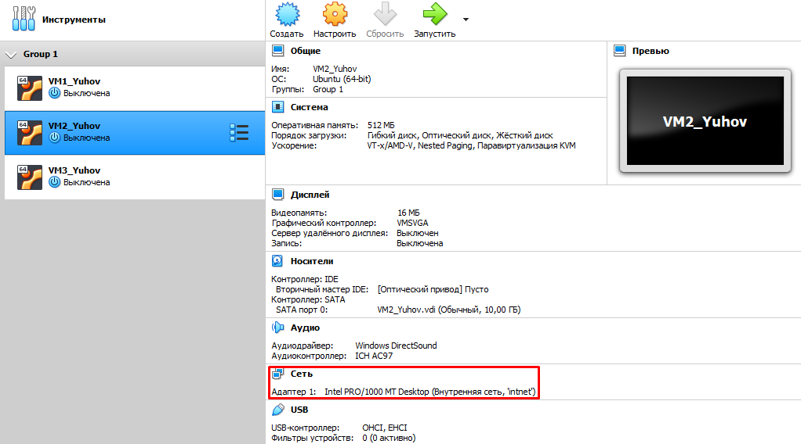
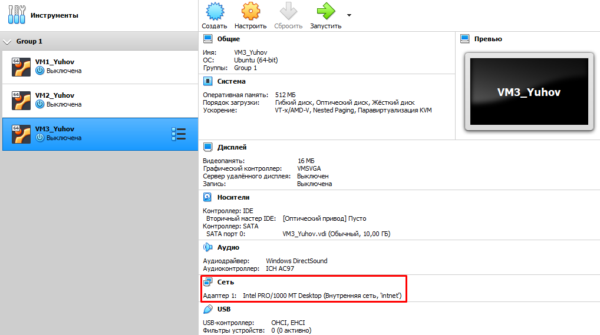
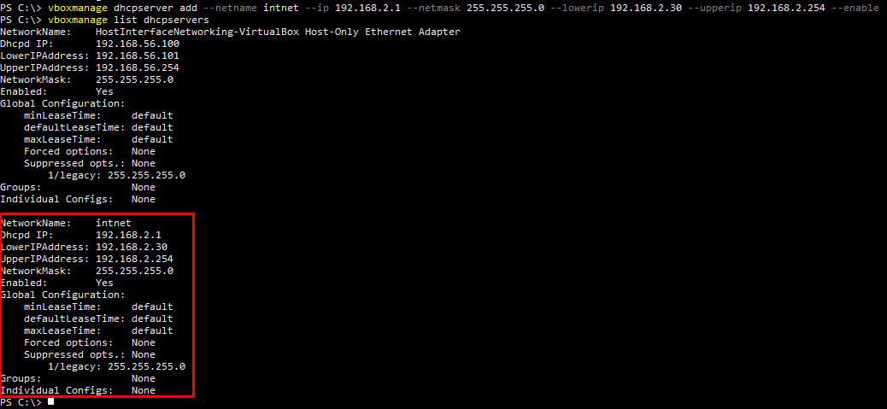
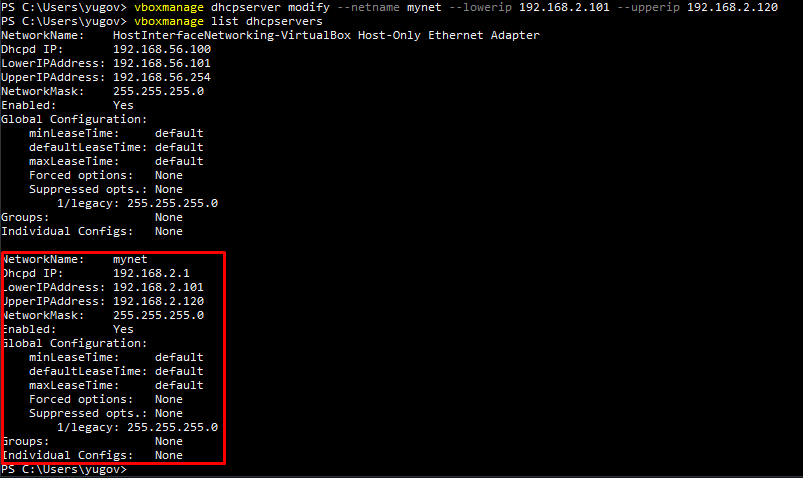
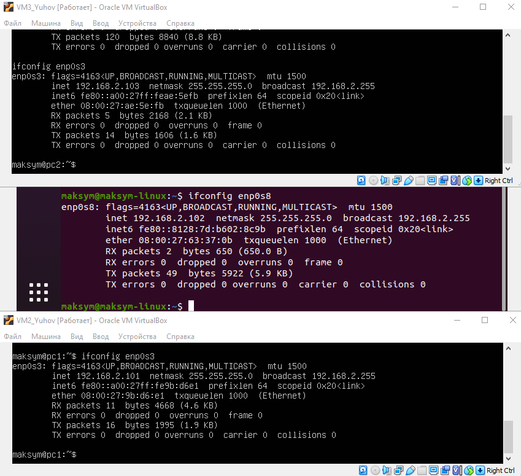
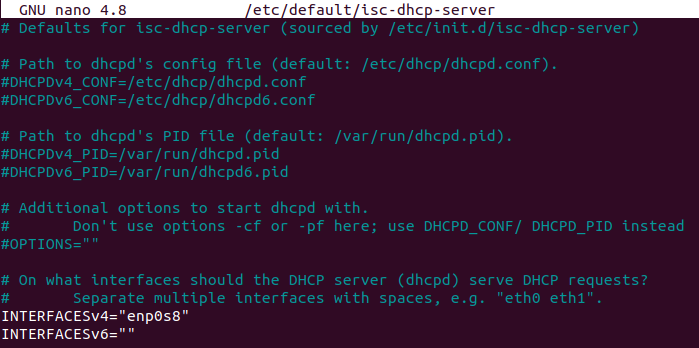
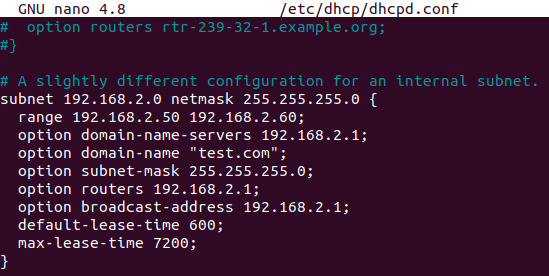
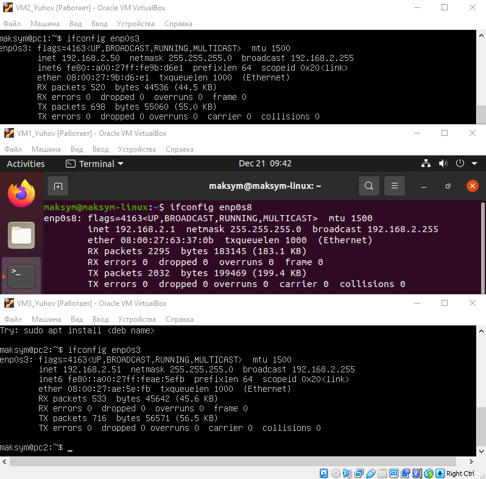
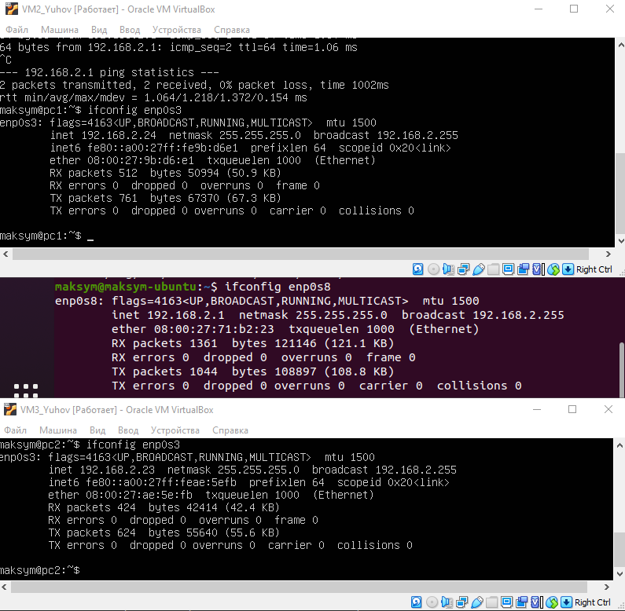

*VM1* has two interfaces: **NAT and internal**   
   
*VM2* and *VM3* have one interface: **internal**  
  
  


CONFIGURE DHCP SERVER
--------------
<details><summary>USING VBOXMANAGE</summary>
  
The ```vboxmanage dhcpserver``` commands allow you to control the DHCP server that is built into VirtualBox.  
To *create a dhcp server* use:
```
vboxmanage dhcpserver add --netname intnet --ip 192.168.2.1 --netmask 255.255.255.0 --lowerip 192.168.2.30 --upperip 192.168.2.254 --enable
```
- ```--netname``` - the name of the network in VirtualBox
- ```-ip``` - IP adress for the dhcp server
- ```--lowerip --upperip``` - the range for the ip addresses that the dhcp can assign  

To see *the list of current dhcp servers* use:
```
vboxmanage list dhcpserver
```
  
To *change the setting* of the dhcpserver use ```vboxmanage dhcpserver modify```:
```
vboxmanage dhcpserver modify —netname mynet —lowerip 192.168.2.101 —upperip 192.168.2.120
```
  
The result:  
  

</details>

<details><summary>USING ISC-DHCP-SERVER</summary>
   
First of all **stop the process of isc-dhcp-server**:
```
sudo service isc-dhcp-server stop
```
Set an interface that *connected with internal network* (enp0s8 in my case):  
```
sudo nano /etc/default/isc-dhcp-server
```
  
Configure the ***dhcp server***:
```
sudo nano /etc/dhcp/dhcpd.conf
```
  
- ```range``` - the range for the ip addresses that the dhcp can assign
- ```option domain-name-servers``` - the IP adress of DNS server
- ```option domain-name``` - domain name
- ```option subnet-mask``` - the mask that will be given to the devices
- ```option routers``` - default gateway 
- ```option broadcast-address``` - the broadcast
- ```default-lease-time``` - this is the period for which the DHCP server assigns an IP address to the client
- ```max-lease-time``` - max period for which the DHCP server assigns an IP address to the client
  
In the end of the configuration **start the isc-dhcp-server**:
```
sudo service isc-dhcp-server start
```
The result:  
  

</details>
  
<details><summary>USING DNSMASQ</summary>
  
Open file ```/etc/dnsmasq.conf```.  
Then find and uncomment following things: 
- ***interface=***
```
interface=enp0s8
```
- ***dhcp-range=***
```
dhcp-range=192.168.2.23, 192.168.2.31, 24h
```
- ***dhcp-option=***
```
dhcp-option=3,192.168.2.1
```
*3* - means default gateway  
- ***dhcp-host=***
```
dhcp-host=08:00:27:ae:5e:fb,192.168.2.23
dhcp-host=08:00:27:9b:d6:e1,192.168.2.24
```
- ***dhcp-authoritative***  
  
When the DHCP server is configured as ***authoritative, the server will respond with DHCP ACK or NACK*** as appropriate for all the received DHCP REQUEST and DHCP INFORM packets belonging to the subnet. ***Non-authoritative DHCP INFORM packets received from the clients on a non-authoritative pool will be ignored***.  
After that turn off the things that may have conflictwith **DNSMASQ**:
```
sudo systemctl disable systemd-resolved
sudo systemctl mask systemd-resolved
sudo systemctl stop systemd-resolved
``` 
And then start your **DNSMASQ**:
```
sudo systemctl start DNSMASQ
```
The result:  
  

  
</details>

--------------


