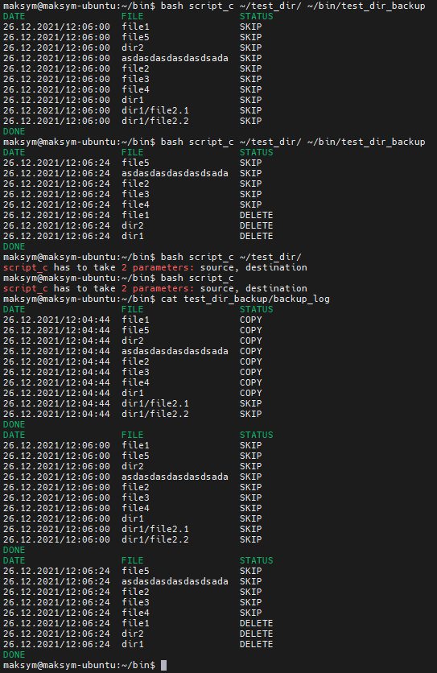

SCRIPT_A
---------

<details><summary>script_a code</summary>

```
#!/bin/bash

function find_open_ports() {
        ss -ant | sed '1d' | awk '{print $4}' | awk -F "([A-Za-z]|[0-9]|\]):" 'BEGIN {print "PORT"} {print $2}' | sort -n | uniq
}

function check_install_nmap() {
        test -e /usr/bin/nmap
        if [ "$?" == "false" ]
        then
                echo "nmap is NOT installed. Start installind"
                sudo apt install nmap
        fi
}

function find_ip() {
        addr=$1
        nmap -sP $addr | sed '$d' | awk 'BEGIN {print "HOSTNAME\tIP"} NR%2 == 0 {n=n+1; print $5"\t" $6} END {print "TOTAL: ", n}' | column -t
}


if [ "$#" == "0" ]
then
        echo -e "\033[31m$0""\033[0m has 2 keys:"
        echo "The --all key displays the IP adresses and symblic names of all hosts in the current subnet"
        echo "The --target key displays a list of open system TCP ports"
elif [ "$1" == "--all" ]
then
        echo -e "\033[32mNext ports are opened:\033[0m"
        find_open_ports
elif [ "$1" == "--target" ]
then
        check_install_nmap
        echo -e "\033[32mThey are such hosts in the network:\033[0m"
        find_ip $2
else
        echo -e "There is\033[31m no \033[0m$1 key"
fi

exit 0
```

-------

</details>

```$#``` - contains amount of command-line argument passed to the shell script  
```\033[31m``` - a set of special characters that *change* the color of text to the ***red***  
```\033[0m``` - a set of special characters that *reset* settings of collor to ***defaults*** 
   
```ss -ant``` - display opened ports  
```sed '1d'``` - delete *the first line*  
```awk '{print $4}'``` - print only *the fourth column*  
```awk -F "([A-Za-z]|[0-9]|\]):" 'BEGIN {print "PORT"} {print $2}'``` - print only ports and add **BEGIN** at the beginning of output  
```sort -n``` - sort the ports by numbers  
```uniq``` - remove *duplicate*  
  
```test -e``` - check for file existence  
```$?``` - the exit *status of the last executed command*  
```nmap -sP $addr``` - displays the IP adresses and symbolic names of all hosts in the subnet **$addr**  
```sed '$d'``` - delete the last line  
```awk 'BEGIN {print "HOSTNAME\tIP"} NR%2 == 0 {n=n+1; print $5"\t" $6} END {print "TOTAL: ", n}'``` - add **HOSTNAME IP** in the beginning of the output, 
print every second line and count them(n=n+1),  add **TOTAL** and numbers of **IP adresses** in the end of the output  
```column -t``` - formats its input into multiple columns. ```-t --table``` - create a table  
  
**The result**:  


SCRIPT_B
---------

<details><summary>script_b code</summary>

```
#!/bin/bash

function mrip() {
	if [ -z $2 ]
	then
		cat $1 | awk '{print $1}' | sort | uniq -c | sort -nr |  awk 'BEGIN {print "\033[32mNN IP COUNT\033[0m"} {print FNR, $2, $1}' | column -t
	else
		cat $1 | awk '{print $1}' | sort | uniq -c | sort -nr | head -n $2 | awk 'BEGIN {print "\033[32mNN IP COUNT\033[0m"} {print FNR, $2, $1}' | column -t 
	fi
}

function mrpa() {
	if [ -z $2 ]
	then
		cat $1 | awk '{print $7}' | sort | uniq -c | sort -nr | awk 'BEGIN {print "\033[32mNN PAGE COUNT\033[0m"} {print FNR, $2, $1}' | column -t
	else
		cat $1 | awk '{print $7}' | sort | uniq -c | sort -nr | head -n $2 | awk 'BEGIN {print "\033[32mNN PAGE COUNT\033[0m"} {print FNR, $2, $1}' | column -t
	fi
}

function non_existent_pages_visited() {
        if [ -z $2 ]
        then
                cat $1 | grep error | awk '{print $1 $7}' | awk -F "/" '{print $1"\t"$2}' | sort | uniq -c | sort -nr | awk 'BEGIN {print "\033[32mNN IP ERROR COUNT\033[0m"} {print FNR, $2, $3, $1}' | column -t
        else
                cat $1 | grep error | awk '{print $1 $7}' | awk -F "/" '{print $1"\t"$2}' | sort | uniq -c | sort -nr | head -n $2 | awk 'BEGIN {print "\033[32mNN IP ERROR COUNT\033[0m"} {print FNR, $2, $3, $1}' | column -t
        fi
}

function mrt() {
	if [ -z $2 ]
        then
                cat $1 | awk '{print $4"]"}' | sort | uniq -c | sort -nr | awk 'BEGIN {print "\033[32mNN TIME COUNT\033[0m"} {print FNR, $2, $1}' | column -t
        else
		cat $1 | awk '{print $4"]"}' | sort | uniq -c | sort -nr | head -n $2 | awk 'BEGIN {print "\033[32mNN TIME COUNT\033[0m"} {print FNR, $2, $1}' | column -t        
	fi
}

function search_bot_request() {
	if [ -z $2 ]
        then
                cat $1 | grep bot | awk -F "\"" '{print $6}' | awk -F "//" '{print $2}' | awk 'NF' | awk -F ")" '{print $1}'  | sort | uniq -c | sort -nr | awk 'BEGIN {print "\033[32mNN BOT COUNT\033[0m"} {print FNR, $2, $1}' | column -t
        else
                cat $1 | grep bot | awk -F "\"" '{print $6}' | awk -F "//" '{print $2}' | awk 'NF' | awk -F ")" '{print $1}'  | sort | uniq -c | sort -nr | head -n $2 | awk 'BEGIN {print "\033[32mNN BOT COUNT\033[0m"} {print FNR, $2, $1}' | column -t
	fi
}

if [ "$#" == "0" ]
then
	echo -e "\033[31m$0""\033[0m has 5 keys:"
	echo "The --mrip the most requested IP adresses"
        echo "The --mrpa the most requested pages"
	echo "The --non-existent-pages-visited IP adresses that got error"
	echo "The --mrt the time site was most requested"
	echo "The --searchbot-request what searchbots requested the site"
	exit 0
elif [ -z $2 ]
then
        echo -e "ERROR. You have to choose an apache_log"
        exit 1
else
	log_name=$2
	search_size=$3
fi

case $1 in
	--mrip) mrip $log_name $search_size;;
        --mrpa) mrpa $log_name $search_size;;
        --non-existent-pages-visited) non_existent_pages_visited $log_name $search_size;;
	--mrt) mrt $log_name $search_size;;
        --search-bot-request) search_bot_request $log_name $search_size;;
	*) echo -e "There is\033[31m no \033[0m$1 key"
esac
exit 0
```
-------

</details>


**The result:**  
  
  
  
  
  

SCRIPT_C
---------


<details><summary>script_c code</summary>

```
#!/bin/bash

function destination_copy_skip_remove() {
#copy_skip
for file in $(find $1 -printf "%P\n")
do 
if [ -a $2/$file ]
then 
  if [ $1/$file -nt $2/$file ]
  then 
  	echo $3 $file COPY
    cp -r $1/$file $2/$file
  else
  	echo $3 $file SKIP
  fi
else
	echo $3 $file COPY
  cp -r $1/$file $2/$file
fi
done
#delete
for file in $(find $2 -printf "%P\n")
do 
if [[ (( -a $2/$file) && (! -a $1/$file)) && ( "$file" != "backup_log" ) ]]
then 
    echo $3 $file DELETE
    rm -r "$2/$file"
fi
done
}

if [[ "$#" < "2" ]]
then
	echo -e "\033[31m$0\033[0m has to take \033[31m2 parameters:\033[0m source, destination"
	exit 1
fi

if [ ! -d "$1" ]
then 
	echo -e "ERROR.The source does not exist!"
	exit 1
elif [ ! -d "$2" ]
then 
	echo -e "The destination does not exist. Trying to create."
	mkdir "$2"
	if [ ! "$?" == "true" ]
	then
		echo -e "\033[32mThe destination was created\033[0m"
	else
		echo -e "\033[31mThe destination was not created!\033[0m"
		exit 1
	fi
fi	

source=$1
destination=$2
dt=$(date '+%d.%m.%Y/%H:%M:%S');

destination_copy_skip_remove $source $destination $dt | awk 'BEGIN {print "\033[32mDATE FILE STATUS\033[0m"} {print $0} END {print "\033[32mDONE\033[0m"}' | column -t | tee -a $destination/backup_log
```
-------

</details>

```if [ ! -d "$1" ]``` - check the existance of the souce directory  
```for file in $(find $1 -printf "%P\n")``` - create a loop that go threw all the files in the ***souce*** directory  
```if [ -a $2/$file ]``` - check if the file in the destination, if no it will be just copied to the destionation  
```if [ $1/$file -nt $2/$file ]``` - if in the source newer version than in the destionation than it will be copied, else no  
  
```for file in $(find $2 -printf "%P\n")``` - create a loop that go threw all the files in the ***destination*** directory  
```if [[ (( -a $2/$file) && (! -a $1/$file)) && ( "$file" != "backup_log" ) ]]``` - if a file exist in ***the destination*** but not in ***the source*** and it is not a backup_log it will be deleted from ***the detination***  
  
```tee -a $destination/backup_log``` - redirect the output to *the backup_log* and to *the console*  

**The result:**  
  
  


CRON
---------
The ***cron*** command-line utility is a *job scheduler*.
To configure it, I use:
```
crontab -e
```
And then wrote inside it:
```
* * * * * /home/maksym/bin/script_c /home/maksym/test_dir /home/maksym/bin/test_dir_backup
```
```* * * * *``` - means that the scrip will be executed *every minute*  
To see the log of CRON, I use:
```
cat /var/log/syslog | grep CRON
```

  
 

PATH
---------

***PATH*** is an environmental variable in Linux and other Unix-like operating systems that tells the shell which directories to *search for executable files*  
To add my script to the PATH, I used:
```
PATH=$PATH:$HOME/bin
```
Now, I can execute them from everywhere:  
 


