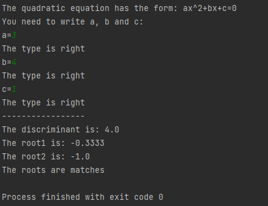
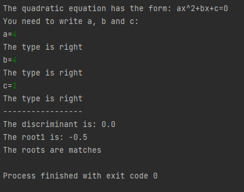
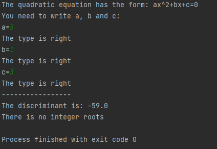
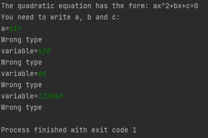

<details><summary>PYTHON CODE</summary>

```
import math

SUCCESS_EXIT = 0
WRONG_TYPE = 1


def validate_param(param):
    # Try to convert the param to the float type, if can't give you 3 chance to write a new variable.
    try:
        param = float(param)
        print("The type is right")
    except:
        print("Wrong type")
        i = 0
        while (type(param) != float and i < 3):
            try:
                param = float(input("variable="))
            except:
                print("Wrong type")
                i += 1
        if i == 3:
            exit(WRONG_TYPE)
    return param


def discriminant(a, b, c):
    # Calculate discriminant
    return b * b - 4 * a * c


def roots(d, a, b):
    # Find the roots of the quadratic equation and the roots to the list, if there is no roots the list is empty
    roots = []
    if d > 0:
        roots.append((-b + d**0.5) / (2 * a))
        roots.append((-b - math.sqrt(d)) / (2 * a))
    elif d == 0:
        roots.append(-b / (2 * a))
    return roots


def square_print(roots):
    # Print every root
    i = 1
    for x in roots:
        print("The root" + str(i) + " is: " + str(round(x, 4)))
        i += 1


def unit_test(a, b, c, roots):
    # Check roots for equality, if there is no integer roots print it
    if len(roots) == 2:
        return "The roots are matches" if (a * roots[0] * roots[0] + b * roots[0] + c) == 0 and (a * roots[1] * roots[1] + b * roots[1] + c) == 0 \
            else "The roots are NO matches"
    elif len(roots) == 1:
        return "The roots are matches" if (a * roots[0] * roots[0] + b * roots[0] + c) == 0 \
            else "The roots are NO matches"
    else:
        return "There is no integer roots"


def main():
    print("The quadratic equation has the form: ax^2+bx+c=0");
    print("You need to write a, b and c:")
    a = input("a=")
    a = validate_param(a)
    b = input("b=")
    b = validate_param(b)
    c = input("c=")
    c = validate_param(c)
    print("-----------------")
    d = discriminant(a, b, c)
    print("The discriminant is: " + str(d))
    root = roots(d, a, b, c)
    square_print(root)
    print(unit_test(a, b, c, root))
    exit(SUCCESS_EXIT)


main()
```

</details>

def validate_param(param)
---------
Get the variable from the ***main()*** and ```try``` to convert it into float type, if it is unsuccessful there will be **an exception**, so ```except:``` will be called. 
In that section ```while``` will be started until you *write the right type of variable* or *you are out of attempts* (which is 3), if you are lack of attempts 
the program will call ```exit(WRONG_TYPE)```  

def discriminant(a, b, c):
---------
Get the variables from the ***main()***. **Calculte the determinate** of the quadratic equation using standart formula   

def roots(a, b, c):
---------
Get the variables from the ***main()***. **Find roots or root** of the quadratic equation using standart formula and then **copy them to the list**  

def square_print(roots):
---------
Get the list of roots from the ***main()***. Print the index of a root using *i* and the root itself.  

def unit_test(a, b, c, roots):
---------
Get the variables and the roots from the ***main()***. **Put the values into the default formula and check for the equality**, if it is ```return "The roots are matches"``` 
else ```return "The roots are NO matches"```


**The result:**  

  

  
